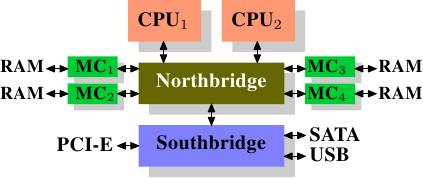

# 2. 现代商用硬件

由于专属的硬件正在退潮，理解商用硬件是很重要的。时至今日，水平发展比起垂直发展更为常见。意味著现今使用许多较小的、连结在一起的商用电脑，而非少数几个非常大型且异常迅速（且昂贵）的系统，是较符合成本效益的。这是因为快速且廉价的网络硬件随处可见。虽然那些大型专门系统仍在一些情况中占有一席之地，并仍旧有其商机，但整体市场已被商用硬件市场蚕食。Red Hat 于 2007 年预测，对于未来的产品，大多资料中心的「标准建构元件（building block）」将会是一台有著至多四个插槽（socket）的电脑，每个插槽插著一颗四核 CPU，这些 CPU ── 以 Intel CPU 而言 ── 都会采用超线程（[hyper-threading](https://en.wikipedia.org/wiki/Hyper-threading)，简称 HT）技术。[^2]这表示资料中心的标准系统将会有至多 64 个虚拟处理器（virtual processor）[^译注]。当然也能够支援更大的机器，但四槽、四核 CPU 是目前认为最适宜的配置，并且大多的最佳化都是针对这种机器。

由商用元件建构出的电脑，结构上也存在著巨大差异。即便如此，我们将专注于最重大的差异上，从而涵盖超过 90% 这类硬件。请注意，这些技术细节日新月异，因此奉劝读者将本文的撰写日期纳入考量。

这些年来，个人电脑以及小型服务器被标准化为一张晶片组（chipset），其具有两个部份：北桥（Northbridge）与南桥（Southbridge）。图 2.1 示意这个结构。

<figure>
  
  <figcaption>图 2.1：包含北桥与南桥的结构</figcaption>
</figure>
所有（在前面的例子中有两颗，但可以有更多）CPU 都透过一条共用的总线（bus）── 前端总线（Front Side Bus，FSB）── 连接到北桥。**北桥包含memory控制器（memory controller）**，而它的实作(implementation)决定用在电脑中的 RAM 晶片类型。不同类型的 RAM ── 诸如 DRAM、Rambus、以及 SDRAM (synchronous DRAM)── 需要不同memory控制器。为了与其它系统装置联系，北桥必须与南桥沟通。**南桥 ── 经常被称作 I/O 桥** ── 借由各种不同的总线与各个装置沟通。
现今，PCI、PCI Express、SATA、与 USB 等最重要的总线，以及 PATA、IEEE 1394、序列埠（serial port）、与平行埠（parallel port）都被南桥所支援。较老旧的系统有附属于北桥的 AGP 槽。这源于南北桥连线速度不够快速的效能因素。然而现今的 PCI-E 槽都是连接到南桥上的。

这种系统结构有一些值得注意的结果：

* 从一颗 CPU 到另一颗 CPU 的所有资料通讯都必须经过与北桥沟通用的同一条总线。
* 所有与 RAM 的沟通都必须通过北桥。
* RAM 只有单埠。[^3] (ram 可以有多个 port 同时支持读写)
* 一颗 CPU 与一个依附于南桥的装置之间的沟通会路经北桥。

几个瓶颈立刻显露在这个设计上。其中一个瓶颈牵涉到**装置对 RAM 的存取**。在最早期的 PC 中，不管在南北桥上，所有装置的沟通都必须经过 CPU，负面地影响整体的系统效能。为了绕过这个问题，某些装置变得能够支援直接memory存取（Direct Memory Access，DMA）。**DMA 允许装置 ── 借由北桥的帮助 ── 在没有 CPU 介入（以及相应效能成本）的情况下直接储存并接收 RAM 中的资料。**现今所有依附于任何总线上的高效能装置都能使用 DMA。虽然这大幅地降低 CPU 的工作量，这也引起北桥频宽的争夺，由于 DMA 请求与来自 CPU 的 RAM 存取相互竞争的缘故。因此，这个问题必须被纳入考量。

第二个瓶颈涉及从**北桥到 RAM 的总线**。总线的确切细节视布署的memory类型而定。在较老旧的系统中，只有一条总线连接所有的 RAM 晶片，因此平行存取是不可能的。近来的memory类型需要两条分离的总线（或称**通道〔channel〕**，如同 DDR2 所称呼的，见图 2.8），其加倍可用的频宽。北桥交错地使用通道进行memory存取。更加近代的memory技术（举例来说，FB-DRAM）加入更多的通道。

由于有限的可用频宽，以延迟最小化的方式排程memory存取，对效能来说是很重要的。如同我们将会看到的，处理器比起memory快许多，而且必须等待存取memory ── 尽管使用 CPU cache。假如多个 HT 或多处理器核同时存取memory，那么memory存取的等待时间甚至会更长。对 DMA 操作依旧如此。

然而，除了并行（concurrency）之外，存取memory还有许多议题。存取模式（access pattern）本身也会大幅地影响memory子系统的效能，尤其是有多个memory通道的情况。在 2.2 节，我们将会涵盖更多 RAM 存取模式的细节。

在一些比较昂贵的系统上，北桥并不真的包含memory控制器。作为替代，北桥可以连接到多个外部memory控制器（在下例中，共有四个）。

<figure>
  
  <figcaption>图 2.2：包含外部控制器的北桥</figcaption>
</figure>

这个架构的优点是，有多于一个memory总线，因而提升整体的可用频宽(bandwidth)。这个设计也支援多个memory。并行（concurrent）memory存取模式借由同时存取不同的记忆库（memory bank）来减少延迟。尤其是多个处理器都直接连接到北桥上的情况，如图 2.2。对于这种设计，主要的限制是北桥的内部频宽 ── 其对这种（来自于 Intel 的）架构而言是非常大的。[^4]

使用多个外部memory控制器并不是提升memory频宽的唯一作法。另一个越来越受欢迎的方式是将memory控制器整合到 CPU，并将memory附加到每颗 CPU 上。这个架构因为基于 AMD 的 Opteron 处理器的 SMP 系统而流行起来。图 2.3 展示这样的系统。
Intel 将从 Nehalem 处理器开始支援通用系统介面（Common System Interface，CSI）；这基本上也是相同的方法：一个让每个处理器都能拥有区域（local）memory的整合式memory控制器。

<figure>
  
  <figcaption>图 2.3：整合式memory控制器</figcaption>
</figure>

采用像这样的架构，有多少处理器，就有多少可用的记忆库。在一台四核 CPU 的机器上，不需有著巨大频宽的复杂北桥，memory频宽就能变成四倍。一个整合到 CPU 的memory控制器也有些额外的优点；但我们不会在这里继续深入这些技术。

这个架构也有缺点。首先，因为机器仍需要让系统上的所有memory都能被所有的处理器存取，memory就不再是均匀的（uniform）（于是这种系统便有了 NUMA ── **非均匀memory架构〔Non-Uniform Memory Architecture〕**── 这个名字）。区域memory（附属于处理器的memory）能够以正常的速度存取。当存取附属于其他处理器的memory时，情况就不同。在这种情况下，就必须用到处理器之间的交互连线（interconnect）。要从 CPU1 存取附属于 CPU2 的memory，就需要通过一条交互连线。当同样的 CPU 存取附属于 CPU4 的memory就得通过两条交互连线。

每次这样的通讯都有其对应的成本。当我们在描述存取远端（remote）memory所需的额外时间时，我们会称之为「NUMA 因子（factor）」。图 2.3 中的范例架构中，每个 CPU 都有两个层级：紧邻的 CPU，以及一颗相隔两条交互连线的 CPU。在更加复杂的系统中，层级会显著地成长。还有一些机器架构（像是 IBM 的 x445 与 SGI 的 Altix 系列）有著不只一种连线类型。CPU 被组织成节点；存取同一节点内的memory的时间会是一致的、或是仅需很小的 NUMA 因子。然而，节点间的连线非常昂贵，而且 NUMA 因子非常高。

如今已有商用的 NUMA 机器，而且可能会在未来扮演著更加重要的角色。预计在 2008 年末，每台 SMP 机器都会使用 NUMA。当一支程序执行在一台 NUMA 机器上时，认识到 NUMA 相应的成本是很重要的。我们将会在第五节讨论更多机器架构，以及一些 Linux 核心（kernel）为这些程序提供的技术。

除了本节其余部分描述的技术细节之外，还有许多影响 RAM 效能的额外因素。它们无法被软件所控制，这也是其不会被涵盖于本节的原因。感兴趣的读者可以在 2.1 节学到其中一些因素。这其实仅是为了对 RAM 的技术有比较完整的理解，而且可能会在购买电脑时做出更好的选择。

接下来的两节会以逻辑门（gate）层级讨论硬件细节，并接触到memory控制器与 DRAM 晶片之间的通讯协议（protocol）。程序开发者或许会发现这些资讯令人豁然开朗，因为这些细节解释为何 RAM 的存取会如此运作。不过，这都是选读的知识，急著了解与日常生活更直接相关主题的读者可以往前跳到 2.2.5 节。

[^2]: 超线程 (HT) 使得一颗处理器核仅需少量的额外硬件，就能被用来同时处理两个或多个任务。
[^3]: 我们不会在本文讨论到多埠 RAM，因为这种 RAM 并不见于商用硬件中，至少不在程序开发者得存取之处。它可以在仰赖极限速度的专门硬件 ── 像是网络路由器 ── 中找到。
[^4]: 完整起见，这里需要提到一下，这类memory控制器布局可以被用于其它用途，像是「memory RAID」，它很适合与热插拔（hotplug）memory组合使用。
[^译注]: 这句的原文是 "the standard system in the data center will have up to 64 virtual processors"，注意到本文发表的时间点在 2007 年，本句是 Red Hat 公司之前的推论，64 个虚拟处理器核意味著 4 个插槽、HT (即 2 个硬件执行绪)，和每个 CPU 要有 8 核，不过这样的硬件配置要到 2014 年的 [POWER8](https://en.wikipedia.org/wiki/POWER8) 才出现，后者的每个 CPU 可有 6 或 12 核。

