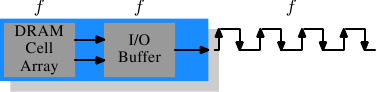
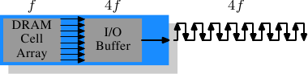

# 2.2.4. memory类型

值得花点时间来看看目前以及即将到来的memory类型。我们将从 SDR（单倍资料传输速率，Single Data Rate）SDRAM 开始，因为它们是 DDR（双倍资料传输速率，Double Data Rate）SDRAM 的基础。SDR 十分简单。记忆单元与资料传输速率是一致的。

<figure>
  
  <figcaption>图 2.10：SDR SDRAM 的运作</figcaption>
</figure>

在图 2.10 中，记忆单元阵列能够以等同于经由memory总线传输的速率输出memory内容。假如 DRAM 记忆单元阵列能够以 100MHz 运作，单一记忆单元的总线的资料传输率便为 100Mb/s。所有元件的频率 $$ f $$ 都是一样的。由于耗能会随著频率增加而增加，因此提升 DRAM 晶片的吞吐量（throughput）的代价很高。由于大量的阵列单元，成本贵得吓人。[^11]实际上，提升频率通常也需要提升电压，以维持系统的稳定性，这更是一个问题。DDR SDRAM（追溯地称为 DDR1）设法在不提高任何相关频率的情况下提升吞吐量。

<figure>
  
  <figcaption>图 2.11：DDR1 SDRAM 的运作</figcaption>
</figure>

SDR 与 DDR1 之间的差异是 ── 如同在图 2.11 所见、以及从它们名称来猜测的 ── 每个周期传输两倍的资料量。也就是说，**DDR1 晶片会在上升*与*下降边沿传输资料**。这有时被称作一条「二倍频（double-pumped）」总线。为了不提升记忆单元阵列的频率，必须引入一个缓冲区（buffer）。这个缓冲区会持有每条资料线的两个bit。这转而要求令 ── 图 2.7 的记忆单元阵列中的 ── 资料总线由两条线路组成。实作的方式很直观：只要对两个 DRAM 记忆单元使用相同的行地址，并且平行存取它们就行。这个实作对记忆单元阵列的改变也非常小。

SDR DRAM 直接采用其频率来命名（例如 PC100 代表 100MHz SDR）。由于 DDR1 DRAM 的频率不会改变，厂商必须想出新的命名方式，让它听起来更厉害。他们提出的名字包含一个 DDR 模组（拥有 64 bit总线）能够维持、以byte为单位的传输速率：

$$
100\text{MHz} \times 64\text{bit} \times 2 = 1,600\text{MB/s}
$$

于是一个频率为 100MHz 的 DDR 模组就称为 PC1600。因为 1600 > 100，满足一切销售需求；这听起来更棒，纵使实际上*只*提升成两倍而已。[^12]

<figure>
  
  <figcaption>图 2.12：DDR2 SDRAM 的运作</figcaption>
</figure>

为了突破这些memory技术，DDR2 包含少许额外的革新。能从图 2.12 上看到的最明显的改变是，总线的频率加倍。频率加倍意味著频宽加倍。由于频率加倍对记忆单元阵列来说并不经济，因此现在需要由 I/O 缓冲区在每个时脉周期读取四个bit，然后才送到总线上。这代表 DDR2 模组的改变是，只让 DIMM 的 I/O 缓冲区元件拥有能以更快速度运转的能力。这当然是可能的，而且不需太多能量，因为这只是个小元件，而非整个模组。厂商为 DDR2 想出的名称与 DDR1 的名称相似，只是在计算值的时候，乘以二变成乘以四（我们现在有条四倍频〔quad-pumped〕总线）。表 2.1 显示现今使用的模组名称。

<figure>
  <table>
    <tr>
      <th>阵列频率</th>
      <th>总线频率</th>
      <th>资料速率</th>
      <th>名称（速率）</th>
      <th>名称（FSB）</th>
    </tr>
    <tr>
      <td>133MHz</td>
      <td>266MHz</td>
      <td>4,256MB/s</td>
      <td>PC2-4200</td>
      <td>DDR2-533</td>
    </tr>
    <tr>
      <td>166MHz</td>
      <td>333MHz</td>
      <td>5,312MB/s</td>
      <td>PC2-5300</td>
      <td>DDR2-667</td>
    </tr>
    <tr>
      <td>200MHz</td>
      <td>400MHz</td>
      <td>6,400MB/s</td>
      <td>PC2-6400</td>
      <td>DDR2-800</td>
    </tr>
    <tr>
      <td>250MHz</td>
      <td>500MHz</td>
      <td>8,000MB/s</td>
      <td>PC2-8000</td>
      <td>DDR2-1000</td>
    </tr>
    <tr>
      <td>266MHz</td>
      <td>533MHz</td>
      <td>8,512MB/s</td>
      <td>PC2-8500</td>
      <td>DDR2-1066</td>
    </tr>
  </table>
  <figcaption>表 2.1：DDR2 模组名称</figcaption>
</figure>

命名上还有个别扭之处。用于 CPU、主机板、以及 DRAM 模组的 FSB 速度是使用*实质上的*频率来指定的。也就是将时脉周期的两个边沿都纳入传输的因素，从而浮夸数字。因此，一个拥有 266MHz 总线的 133MHz 模组，它的 FSB「频率」为 533MHz。

沿著转变到 DDR2 的路线，DDR3（真正的 DDR3，而非用于显卡中的假 GDDR3）的规范寻求更多的改变。电压从 DDR2 的 1.8V 降至 DDR3 的 1.5V。由于功率消耗公式是使用电压的平方来算的，因此光这点就改善 30%。加上晶粒（die）尺寸的缩小以及其它电气相关的改进，DDR3 能够在相同的频率下降低一半的功率消耗。或者，在相同功率包络（envelope）的情况下达到更高的频率。又或者，在维持相同热能排放量的情况下加倍容量。

DDR3 模组的记忆单元阵列会以外部总线的四分之一速度运转，其需要将 DDR2 的 4 bit I/O 缓冲区加大到 8 bit。示意图见图 2.13。

<figure>
  
  <figcaption>图 2.13：DDR3 SDRAM 的运作</figcaption>
</figure>

起初，DDR3 模组的 $$ \overline{\text{CAS}} $$ 等待时间可能会略高一些，因为 DDR2  技术更为成熟。这导致只在频率高于 DDR2 所能达到的情况，并且 ── 尽管如此 ── 一般在频宽比延迟时间更为重要的时候，DDR3 才有其用处。已有达到与 DDR2 相同 $$ \overline{\text{CAS}} $$ 等待时间的 1.3V 模组的风声。无论如何，由于更快的总线，达到更高速度的可能性将会超过增加的等待时间。

一个 DDR3 的可能问题是，对于 1,600Mb/s 或更高的传输率，每个通道的模组数量可能会减至仅剩一个。在早期的版本中，对于任何频率都有这个要求，所以可以期待在某个时间点，这项要求会被剔除。否则会严重地限制系统的能力。

表 2.2 列出我们很可能会看到的 DDR3 模组名称。JEDEC 到目前为止接受前四种。鉴于 Intel 的 45nm 处理器拥有速度为 1,600Mb/s 的 FSB，1,866Mb/s 便为超频市场所需。随著 DDR3 的发展，我们大概会看到更多的类型。

<figure>
  <table>
    <tr>
      <th>阵列频率</th>
      <th>总线频率</th>
      <th>资料速率</th>
      <th>名称（速率）</th>
      <th>名称（FSB）</th>
    </tr>
    <tr>
      <td>100MHz</td>
      <td>400MHz</td>
      <td>6,400MB/s</td>
      <td>PC3-6400</td>
      <td>DDR3-800</td>
    </tr>
    <tr>
      <td>133MHz</td>
      <td>533MHz</td>
      <td>8,512MB/s</td>
      <td>PC3-8500</td>
      <td>DDR3-1066</td>
    </tr>
    <tr>
      <td>166MHz</td>
      <td>667MHz</td>
      <td>10,667MB/s</td>
      <td>PC3-10667</td>
      <td>DDR3-1333</td>
    </tr>
    <tr>
      <td>200MHz</td>
      <td>800MHz</td>
      <td>12,800MB/s</td>
      <td>PC3-12800</td>
      <td>DDR3-1600</td>
    </tr>
    <tr>
      <td>233MHz</td>
      <td>933MHz</td>
      <td>14,933MB/s</td>
      <td>PC3-14900</td>
      <td>DDR3-1866</td>
    </tr>
  </table>
  <figcaption>表 2.2：DDR3 模组名称</figcaption>
</figure>

所有的 DDR memory都有个问题：总线频率的提升，会使得建立平行资料总线变得困难。DDR2 模组有 240 根针脚。必须要规划所有连结到资料与地址针脚的布线，以让它们有大略相同的长度。还有个问题是，假如多过一个 DDR 模组被菊花链结（daisy-chain）在同一条总线上，对于每个附加的模组而言，讯号会变得越来越歪曲。DDR2 规范只允许在每个总线（亦称作通道）上有两个模组，DDR3 规范在高频时只能有一个。由于每个通道有 240 根针脚，使得单一北桥无法合理地驱动多于两个通道。替代方式是拥有外部的memory控制器（如图 2.2），但这代价不小。

这所代表的是，商用主机板受限于至多持有四个 DDR2 或 DDR3 模组。这大大地限制一个系统能够拥有的memory总量。即使是老旧的 32 bit IA-32 处理器都能拥有 64GB 的 RAM，即使对于家用，memory需求也在持续增长，所以必须作点什么。

一个解决办法是将memory控制器加到每个处理器中，如同第二节所述。AMD 的 Opteron 系列就是这么做的，Intel 也将以他们的 CSI 技术来达成。只要处理器所能使用的、适当的memory容量都能被连接到单一处理器上，这会有所帮助。在某些情况下并非如此，这个设置会引入 NUMA 架构，伴随著其负面影响。对某些情况来说，则需要另外的解法。

Intel 针对大型服务器机器的解法 ── 至少在现在 ── 被称为全缓冲 DRAM （Fully Buffered DRAM，FB-DRAM）。FB-DRAM 模组使用与现今 DDR2 模组相同的memory晶片，这使得它的生产相对便宜。差异在连结到memory控制器的连线中。FB-DRAM 使用的并非平行资料总线，而是一条序列总线（也能追溯 Rambus DRAM、PATA 的后继者 SATA 以及 PCI/AGP 的后继者 PCI Express）。序列总线能以极高频驱动、恢复序列化的负面影响，甚至提升频宽。使用序列总线的主要影响为

1. 每个通道能使用更多模组。
2. 每个北桥／memory控制器能使用更多通道。
3. 序列总线是被设计成全双工的（fully-duplex）（两条线）。
4. 实作一条差动（differential）总线（每个方向两条线）足够便宜，因而能提高速度。

相比于 DDR2 的 240 根针脚，一个 FB-DRAM 模组只有 69 根针脚。由于能较为妥善地处理总线的电气影响，菊花链结 FB-DRAM 模组要简单许多。FB-DRAM 规范允许每通道至多 8 个 DRAM 模组。

以双通道北桥的连线需求来比较，现在可能以更少的针脚来驱动 FB-DRAM 的六个通道：2 × 240 根针脚对比于 6 × 69 根针脚。每个通道的布线更为简单，这也有助于降低主机板的成本。

对于传统 DRAM 模组来说，全双工平行总线贵得吓人，因为要将所有线路变为两倍的成本高昂。使用序列线路（即使是如 FB-DRAM 所需的差动式）情况就不同，序列总线因而被设计为全双工，意味著在某些情况下，理论上光是如此频宽就能加倍。但这并非唯一使用平行化来提升频宽之处。由于一个 FB-DRAM 控制器能够同时连接多达六个通道，即使对于较小 RAM 容量的系统，使用 FB-DRAM 也能够提升频宽。在具有四个模组的 DDR2 系统拥有两个通道的情况下，相同的能力得以使用一个普通的 FB-DRAM 控制器，经由四个通道来达成。序列总线的实际频宽取决于用在 FB-DRAM 模组的 DDR2（或 DDR3） 晶片类型。

我们能像这样总结优点：

 X | DDR2 | FB-DRAM
--- | --- | ---
针脚数 | 240 | 69
通道数 | 2 | 6
DIMM 数／通道数 | 2 | 8
最大memory[^13] | 16GB[^14] | 192GB
吞吐量[^15] | ~10GB/s | ~40GB/s

如果要在一个通道上使用多个 DIMM，FB-DRAM 有几个缺点。在链结的每个 DIMM 上，讯号会被延迟 ── 尽管很小，因而增加等待时间。第二个问题是，晶片驱动序列总线需要大量的能量，因为频率非常高、以及驱动总线的需求。但有著同样频率、同样memory容量的 FB-DRAM 总是比 DDR2 与 DDR3 还快，至多四个的 DIMM 每个都能拥有自己的通道；对于大型memory系统，DDR 完全没有任何使用商用元件的解决方法。

[^11]: 功率 = 动态电容 × 电压2 × 频率

[^12]: 我会使用二作为倍率，但我不必喜欢浮夸的数字。

[^13]: 假设为 4GB 模组。

[^14]: 一份 Intel 的简报 ── 基于某些我不理解的原因 ── 说是 8GB...

[^15]: 假设为 DDR2-800 模组。

