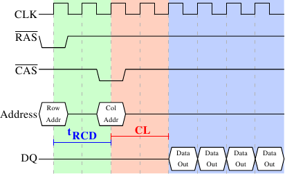

# 2.2.1. 读取协议

<figure>
  
  <figcaption>图 2.8：SDRAM 读取时序</figcaption>
</figure>

图 2.8 显示 DRAM 模组上一些连线的活动，发生在三个标上不同颜色的阶段。像往常一样，时间从左到右流动。许多细节被省略。这里我们仅讨论总线时钟、$$ \overline{\text{RAS}} $$ 与 $$ \overline{\text{CAS}} $$ 讯号、以及地址与资料总线。读取周期从memory控制器在地址总线提供行地址、并降低 $$ \overline{\text{RAS}} $$ 讯号的电位开始。所有讯号都会在时钟（CLK）的上升边沿（rising edge）被读取，因此若是讯号并不是完全的方波也无所谓，只要在读取的这个时间点是稳定的就行。设置行地址会使得 RAM 晶片锁上（latch）指定的行。

经过 **tRCD**（$$ \overline{\text{RAS}} $$ 至 $$ \overline{\text{CAS}} $$ 的延迟）个时脉周期之后，便能发出 $$ \overline{\text{CAS}} $$ 讯号。这时列地址便能借由地址总线提供、以及降低 $$ \overline{\text{CAS}} $$ 线路的电位来传输。这里我们可以看到，地址的两个部分（约莫是对半分，其余的情况并不合理）是如何透过同样的地址总线来传输。

现在定址已经完成，可以传输资料。为此 RAM 晶片需要一点时间准备。这个延迟通常被称作 $$ \overline{\text{CAS}} $$ 等待时间（$$ \overline{\text{CAS}} $$ Latency，**CL**）。在图 2.8 中，$$ \overline{\text{CAS}} $$ 等待时间为 2。这个值可高可低，取决于memory控制器、主机板、以及 DRAM 模组的品质。等待时间也可以是半周期。以 CL=2.5 而言，资料将能够在蓝色区块的第一个*下降*边沿时取得。

对于取得资料的这些准备工作而言，仅传输一个word的资料是很浪费的。这即是为何 DRAM 模组允许memory控制器指定要传输多少资料。通常选择在 2、4、或 8 word之间。这便能在不提供新的 $$ \overline{\text{RAS}} $$／$$ \overline{\text{CAS}} $$ 序列的情况下填满cache中的整行（line）。memory控制器也能够在不重设列的选取的情况下发出新的 $$ \overline{\text{CAS}} $$ 讯号。借由这种方式，能够非常快速地读取或写入连续的memory地址，因为不必发出 $$ \overline{\text{RAS}} $$ 讯号，也不必将行无效化（deactivate）（见后文）。memory控制器必须决定是否让行保持「开启（open）」。一直任其开启，对实际的应用程序来说有些负面影响（见 [3]）。发出新的 $$ \overline{\text{CAS}} $$ 讯号仅受 RAM 模组的命令速率（command rate）控制（通常设为 T*x*，其中 *x* 为像是 1 或 2 的值；每个周期都接受命令的高效能 DRAM 模组会设为 1）。

在这个例子中，SDRAM 在每个周期吐出一个word。第一世代就是这么做的。DDR 能够在每个周期传输两个word。这减少传输时间，但没有改变等待时间。虽然在实务上看起来不同，但原理上 DDR2 运作如斯。这里没有再深入细节的必要。能够注意到 DDR2 可以变得更快、更便宜、更可靠、并且更省电（更多资讯见 [6]）就够。

