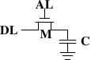

# 2.1.2. 动态 RAM

动态 RAM 在其结构上比静态 RAM 简单许多。图 2.5 示意了常见的 DRAM 记忆单元设计结构。它仅由一个晶体管以及一个电容（capacitor）组成。复杂度上的巨大差异，自然意味著其与静态 RAM 的运作方式非常不同。

<figure>
  
  <figcaption>图 2.5：1-T 动态 RAM</figcaption>
</figure>

一个动态 RAM 的记忆单元在电容 $$ \mathbf{C} $$ 中保存其状态。晶体管 $$ \mathbf{M} $$ 用以控制状态的存取。为了读取记忆单元的状态，要提高存取线路 $$ \mathbf{AL} $$ (access line)的电位；这要不使得电流流经资料线路（data line） $$ \mathbf{DL} $$、要不没有，取决于电容中的电量。要写到记忆单元中，则要适当地设置资料线路 $$ \mathbf{DL} $$，然后提高 $$ \mathbf{AL} $$ 的电位一段足以让电容充电或放电的时间。

动态 RAM 有许多设计上的难题。**使用电容意味著读取记忆单元时会对电容放电。这件事无法不断重复，必须在某个时间点上对电容重新充电**。更糟的是，为了容纳大量的记忆单元（晶片有著 109 或者更多的记忆单元在现今是很普遍的），电容的电量必须很低（在飞〔femto，10-15〕法拉范围内或者更小）。完全充电后的电容容纳了数万个电子。尽管电容的电阻很高（几兆欧姆），耗尽电容仍旧只需要很短的时间。这个问题被称为「漏电（leakage）」。

这种泄漏是 DRAM 必须被持续充电的原因。对于现今大部分 DRAM 晶片，每 64ms 就必须重新充电一次。在重新充电的期间内是无法存取memory的，因为重新充电基本上就是直接丢弃结果的读取操作。对某些工作而言，这个额外成本可能会延误高达 50% 的memory存取（见 [3]）。

第二个 –– 因微小电量而造成 –– 的问题是，从记忆单元读取的资讯无法直接使用。资料线路必须被连接到感测放大器（sense amplifier），其能够根据仍需计作 1 的电量范围来分辨储存的 0 或 1。

第三个问题是，从记忆单元进行读取会消耗电容的电量。这代表每次的读取操作都必须接著进行重新对电容充电的操作。这能够透过将感测放大器的输出返回到电容里头来自动达成。虽然这代表读取memory内容需要额外的电力以及 –– 更为重要地 –– 时间。

第四个问题是，对电容充放电并不是立即完成的。由于感测放大器接收到的讯号并不是直角的，因此必须使用一个谨慎的估计，以得知何时可以使用记忆单元的输出。对电容充放电的公式为

$$
\begin{aligned}
Q_{\text{Charge}}(t) &= Q_{0}(1 - e^{-\frac{t}{RC}})
\\
Q_{\text{Discharge}}(t) &= Q_{0} e^{-\frac{t}{RC}}
\end{aligned}
$$

这代表让电容充电或放电需要一些时间（由电量 C 与电阻 R 决定）。这也代表无法立即使用能被感测放大器侦测的电流。图 2.6 显示了充电与放电的曲线。X 轴以 RC（电阻乘上电量）为单位，这是一种时间单位。

<figure>
  
  <figcaption>图 2.6：电容充电与放电时间</figcaption>
</figure>
**不像静态 RAM 能够在word存取线路的电位提高时立即取得输出结果，它会花费一些时间以让电容被充分放电。这个延迟严重地限制了 DRAM 能够达到的速度。**

简单的方法也有其优点。最主要的优点是大小。比起一个 SRAM 的记忆单元，一个 DRAM 的记忆单元所需的晶片面积要小好几倍。SRAM 记忆单元也需要个别的电力来维持晶体管的状态。DRAM 记忆单元的结构也较为简单，这代表能较轻易地将许多记忆单元紧密地塞在一起。

总体来说，赢在（极为戏剧性的）成本差异。除了在专门的硬件 –– 举例来说，网络路由器 –– 之外，我们必须采用基于 DRAM 的主memory。这对程序开发者有著巨大的影响，我们将会在本文的其余部分讨论它们。但首先，我们需要先多理解一些实际使用 DRAM 记忆单元的细节。

