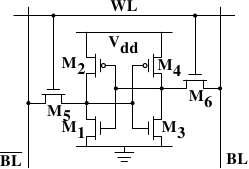

# 2.1.1. 静态 RAM

<figure>
  
  <figcaption>图 2.4：6-T 静态 RAM</figcaption>
</figure>

图 2.4 展示了一组由 6 个晶体管 (transistor) 构成的 SRAM 记忆单元（cell）的结构。这个记忆单元的中心是四个晶体管 $$ \mathbf{M_{1}} $$ 到 $$ \mathbf{M_{4}} $$，其形成两个交叉耦合（cross-coupled）的反相器（inverter）。它们有两个稳定状态，分别表示 0 与 1。只要 $$ \mathbf{V_{dd}} $$ 维持通电，状态就是稳定的。

若是需要存取记忆单元的状态，就提高word存取线路（word access line）$$ \mathbf{WL} $$ 的电位。若是必须复写记忆单元的状态，则要先将 $$ \mathbf{BL} $$ 与 $$ \overline{\mathbf{BL}} $$ 线路设为想要的值，然后再提高 $$ \mathbf{WL} $$ 的电位。由于外部的驱动者（driver）强于四个晶体管（$$ \mathbf{M_{1}} $$ 到 $$ \mathbf{M_{4}} $$），这使得旧的状态得以被覆写。

需要更多记忆单元运作方式的详细描述，请见 [20]。为了接下来的讨论，要注意的重点是

* 一个记忆单元需要六个晶体管。也有四个晶体管的变体，但其有些缺点。
* 维持记忆单元的状态需要持续供电。
* 当提高word存取线路 $$ \mathbf{WL} $$ 的电位时，几乎能立即取得记忆单元的状态。其讯号如同其它晶体管控制的讯号，是直角的（rectangular）（在两个二元状态间迅速地转变）。
* 记忆单元的状态是稳定的，不需要再充电周期（refresh cycle）。

也有其它可用的 SRAM 形式 –– 较慢且较省电。但因为我们寻求的是更快的 RAM，所以在此我们对它并不感兴趣。这些慢的变种引发关注的主要原因是，它们比起动态 RAM 更容易被用在系统中，因为它们的介面较为简单。

