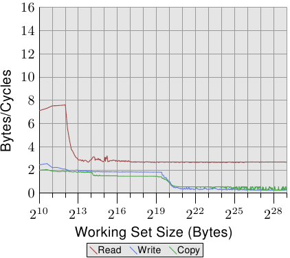
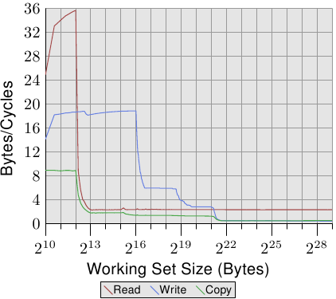

# 3.5.1. cache与memory频宽

为了更好地理解处理器的能力，我们要量测在最理想情况下的可用频宽。这个量测格外有趣，因为不同处理器版本的差异很大。这即是本节充满著数个不同机器数据的原因。量测效能的程序使用 x86 与 x86-64 处理器的 SSE 指令以同时载入或储存 16 byte。就如同我们的其它测试一样，工作集从 1kB 增加到 512MB，并量测每个周期能够载入或储存多少byte。

<figure>
  
  <figcaption>图 3.24：Pentium 4 的频宽</figcaption>
</figure>

图 3.24 显示在一台 64 bit Intel Netburst 处理器上的效能。对于能够塞进 L1d 的工作集大小，处理器每个周期能够读取完整的 16 byte –– 即，每个周期执行一次载入指令（`movaps` 指令一次搬移 16 byte）。测试不会对读取的资料做任何事，我们测试的仅有读取指令本身。一旦 L1d 不再足够，效能就立刻大幅地降低到每周期少于 6 byte。在 218 的一步是因为 DTLB cache的枯竭，表示每个新分页的额外工作。由于读取是循序的，预取能够完美地预测存取，并且对于所有工作集大小，FSB 能以大约每周期 5.3 byte传输memory内容。不过，预取的资料不会传播到 L1d。这些当然是真实程序中永远无法达到的数字。将它们想成实际上的极限吧。

比起读取的效能，令人更为吃惊的是写入与复制的效能。写入的效能 –– 即便对于很小的工作集大小 –– 始终不会上升到每周期 4 byte以上。这暗示著，在这些 Netburst 处理器上，Intel 为 L1d 选择使用直写模式，其中的效能显然受限于 L2 的速度。这也代表复制测试 –– 其从一个memory区域复制到第二个、不重叠的memory区域 –– 的效能并没有显著地变差。所需的读取操作要快得多，并且能够与写入操作部分重叠。写入与复制量测中，最值得注意的细节是，当 L2 cache不再足够时的低效能。效能跌落到每周期 0.5 byte！这表示写入操作比读取操作慢十倍。这意味著，对于这个程序的效能而言，最佳化那些操作是更加重要的。

<figure>
  
  <figcaption>图 3.25：有著 2 条 HT 的 P4 频宽</figcaption>
</figure>

在图 3.25 中，我们看到在相同处理器上、但以两条执行绪执行的结果，每条执行绪各自归属于处理器的两条 HT 的其中一条上。这张图表与前一张使用相同的刻度，以阐明两者的差异。曲线有些微抖动，仅是因为量测两条并行执行绪的问题。结果如同预期。由于 HT 共享暂存器以外的所有资源，每条执行绪都只有一半的cache与可用频宽。这表示，即使每条执行绪都必须等待很久、并能够将执行时间拨给另一条执行绪，这也没有造成任何不同，因为另一条执行绪也必须等待memory。这忠实地显示使用 HT 的最差情况。

<figure>
  
  <figcaption>图 3.26：Core 2 的频宽</figcaption>
</figure>

<figure>
  
  <figcaption>图 3.27：有著 2 条 HT 的 Core 2 频宽</figcaption>
</figure>

对比图 3.24 与图 3.25，对于 Intel Core 2 处理器，图 3.26 与 3.27 的结果看起来差异甚大。这是一个有著共享 L2 的双核处理器，其 L2 是 P4 机器上的 L2 的四倍大。不过，这只解释写入与复制效能延后下降的原因。

有另一个、更大的不同。整个工作集范围内的读取效能停留在大约是最佳的每周期 16 byte。读取效能在 220 byte之后的下降同样是因为工作集对 DTLB 来说太大。达到这么高的数字代表处理器不仅能够预取资料、还及时传输资料。这也代表资料被预取至 L1d 中。

写入与复制的效能也大为不同。处理器没有直写策略；写入的资料被储存在 L1d 中，而且仅会在必要时逐出。这使得写入速度接近于最佳的每周期 16 byte。一旦 L1d 不再足够，效能便显著地降低。如同使用 Netburst 处理器的情况，写入的效能显著地降低。由于读取效能很高，这里的差距甚至更大。事实上，当 L2 也不再足够时，速度差异甚至提升到 20 倍！这不代表 Core 2 处理器表现得很糟。相反的，它们的效能一直都比 Netburst 处理器核还好。

在图 3.27 中，测试执行两条执行绪，各自在 Core 2 处理器两颗处理器核的其中一颗上。两条执行绪都存取相同的memory，不过不需要完美地同步。读取效能的结果跟单执行绪的情况没什么不同。看得到稍微多一点的抖动，这在任何多执行绪的测试案例里都在预期之中。

有趣的一点是，对于能塞进 L1d 的工作集大小的写入与复制效能。如同图中能看到的，效能就像是资料必须从主memory读取一样。两条执行绪都争夺著相同的memory位置，因而必须送出cache行的 RFO 讯息。麻烦之处在于，即使两颗处理器核共享cache，这些请求也不是以 L2 cache的速度处理。一旦 L1d cache不再足够，被修改的项目会从每颗处理器核的 L1d 冲出到共享的 L2。这时，由于 L1d 的错失被 L2 cache所弥补、而且只有在资料还没被冲出时才需要 RFO 讯息，效能便显著地增加。这即是我们看到，对于这些工作集大小，速度降低 50% 的原因。这个渐近行为如同预期一般：由于两颗处理器核共享相同的 FSB，每颗处理器核会得到一半的 FSB 频宽，这表示对于大工作集而言，每条执行绪的效能大约是单执行绪时的一半。

<figure>
  
  <figcaption>图 3.28：AMD 10h 家族 Opteron 的频宽</figcaption>
</figure>

即使同个供应商的处理器版本之间都有显著的差异，所以当然也值得看看其它供应商的处理器效能。图 3.28 显示一个 AMD 10h 家族 Opteron 处理器的效能。这个处理器拥有 64kB L1d、512kB L2、以及 2MB 的 L3。L3 cache被处理器的所有核所共享。效能测试的结果能在图 3.28 看到。

注意到的第一个关于数字的细节是，假如 L1d cache足够的话，处理器每个周期能够处理两条指令。读取效能超过每周期 32 byte，甚至连写入效能都很高 –– 每周期 18.7 byte。不过，读取的曲线立刻就掉下去，而且非常低 –– 每周期 2.3 byte。对于这个测试，处理器没有预取任何资料，至少不怎么有效率。

另一方面，写入曲线的表现则取决于不同cache的大小。在 L1d 全满时达到效能高峰，于 L2 降到 6 byte，于 L3 降到 2.8 byte，最后在连 L3 也无法容纳所有资料时，降到每周期 .5 byte。在 L1d cache时的效能超越（较旧的）Core 2 处理器，L2 存取一样快（因为 Core 2 有个比较大的cache），而 L3 与主memory存取则比较慢。

复制的效能无法比读取或写入的效能还要来得好。这即是我们看到，这条曲线起初被压在读取效能下面、而后又被压在写入效能下面的原因。

<figure>
  
  <figcaption>图 3.29：有著 2 条 HT 的 AMD 10h 家族的频宽</figcaption>
</figure>

Opteron 处理器的多执行绪效能显示于图 3.29。读取效能基本上不受影响。每条执行绪的 L1d 与 L2 如先前一般运作，而在这个例子下的 L3 cache也没预取得很好。两条执行绪没有因其目的而过分地压榨 L3。在这个测试中的大问题是写入的效能。所有执行绪共享的资料都得通过 L3 cache。这种共享看起来非常没有效率，因为即使 L3 cache的大小足以容纳整个工作集，成本也远大于一次 L3 存取。将这张图与图 3.27 相比，我们看到在适当的工作集大小范围中，Core 2 处理器的两条执行绪是以共享的 L2 cache的速度来运作的。对于 Opteron 处理器，这种效能水平*只有*在一个非常小范围的工作集大小内才能达到，而即使在这里，它也只能接近 L3 的速度，比 Core 2 的 L2 还慢。

