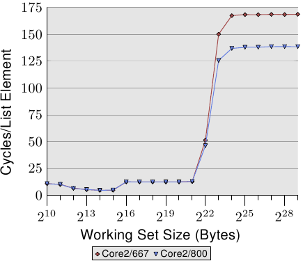

# 3.5.4. FSB 的影响

<figure>
  
  <figcaption>图 3.32：FSB 速度的影响</figcaption>
</figure>

FSB 在机器的效能中扮演一个重要的角色。cache内容只能以跟memory的连线所允许的一样快地被储存与写入。我们能够借由在两台仅在memory模组速度上有差异的机器上执行一支程序，来看看到底怎么样。图 3.32 显示以一台 64 bit机器、`NPAD`=7 而言，Addnext0 测试（将下一个元素的 `pad[0]` 元素加到自己的 `pad[0]` 元素上）的结果。两台机器都拥有 Intel Core 2 处理器，第一台使用 667MHz DDR2 模组，第二台则是 800MHz 模组（提升 20%）。

数据显示，当 FSB 真的受很大的工作集大小所压迫时，我们的确看到巨大的优势。在这项测试中，量测到的最大效能提升为 18.2%，接近理论最大值。这表示，更快的 FSB 确实能够省下大量的时间。当工作集大小能塞入cache时（这些处理器有一个 4MB L2），这并不重要。必须记在心上的是，这里我们测量的是一支程序。一个系统的工作集包含所有同时执行的行程所需的memory。如此一来，以小得多的程序就可能轻易超过 4MB 以上的memory。

现今，一些 Intel 的处理器支援加速到 1,333MHz 的 FSB，这可能代表著额外 60% 的提升。未来将会看到更高的速度。若是速度很重要、并且工作集大小更大，肯定是值得投资金钱在快速的 RAM 与很高的 FSB 速度的。不过必须小心，因为即使处理器可能会支援更高的 FSB 速度，但主机板／北桥可能不会。检查规格是至关重要的。

