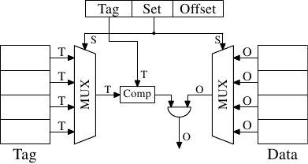

# 3.3.1. 关联度

实作一个每个cache行都能保存任意memory位置副本的cache是有可能的（见图 3.5）。这被称为一个*全关联式cache（fully associative cache）*。要存取一个cache行，处理器核必须要将每个cache行的标签与请求地址的标签进行比较。标签会由地址中不是cache行偏移量的整个部分组成（这表示在 3.2 节图示中的 $$ \mathbf{S} $$ 为零）。

有些cache是像这样实作的，但是看看现今使用的 L2 数量，证明这是不切实际的。给定一个有著 64B cache行的 4MB cache，这个cache将会有 65,536 个项目。为了达到足够的效能，cache逻辑必须要能够在短短几个周期内，从这所有的项目中挑出符合给定标签的那一个。实作这点要付出庞大的精力。

<figure>
  
  <figcaption>图 3.5：全关联式cache示意图</figcaption>
</figure>

对每个cache行来说，都需要一个比较器（comparator）来比对很大的标签（注意，$$ \mathbf{S} $$ 为零）。紧邻著每条连线的字母代表以bit为单位的宽度。假如没有给定，那么它就是一条单一bit的线路。每个比较器都必须比对两个 $$ \mathbf{T} $$ bit宽的值。接著，基于这个结果，选择合适的cache行内容，并令它能被取得。有多少cache行，都得合并多少组 $$ \mathbf{O} $$ 资料线。实作一个比较器所需的晶体管数量很大，特别是它必须运作地非常快的时候。叠代比较器（iterative comparator）是不可用的。节省比较器数量的唯一方式，就是反覆地比较标签以减少比较器的数量。这与叠代比较器并不合适的理由相同：它太花时间了。

全关联式cache对小cache（例如在某些 Intel 处理器的 TLB cache就是全关联式的）来说是有实用价值的，但那些cache都很小，非常小。我们所指的是至多只有几十个项目的情况。

对 L1i、L1d、以及更高层级的cache来说，需要采用不同的方法。我们所能做的是限缩搜寻。在最极端的限制中，每个标签都恰好对映到一个cache项目。计算方式很简单：给定 4MB／64B、有著 65,536 个项目的cache，我们能够直接使用地址的 6 到 21 bit（16 个bit）来直接定址每个项目。低 6 bit是cache行内部的索引。

<figure>
  
  <figcaption>图 3.6：直接对映式cache示意图</figcaption>
</figure>

如图 3.6 所见到的，这种*直接对映式cache（direct-mapped cache）*很快，而且实作起来相对简单。它需要一个比较器、一个多工器（在这张示意图中有两个，标签与资料是分离的，但在这个设计上，这点并不是个硬性要求）、以及一些用以选择有效cache行内容的逻辑。比较器是因速度要求而复杂，但现在只有一个；因此，便能够花费更多的精力来让它变快。在这个方法中，实际的复杂之处都落在多工器上。在一个简易的多工器上，晶体管的数量以 $$ O(\log N) $$ 成长，其中 $$ N $$ 为cache行的数量。这能够容忍，但可能会慢了点，在这种情况下，借由在多工器中增加更多的晶体管以平行化某些工作，便能够提升速度。晶体管的总数能够缓慢地随著cache大小的成长而成长，使得这种解法非常有吸引力。但它有个缺点：只有在程序用到的地址，对于用以直接映射的bit来说是均匀分布的情况下，它才能运作得很好。若非如此，而且经常这样的话，某些cache项目会因为频繁地使用而被重复地逐出，而其余的项目则几乎完全没用到、或者一直是空的。

<figure>
  
  <figcaption>图 3.7：集合关联式cache示意图</figcaption>
</figure>

这个问题能借由让cache*集合关联（set associative）*来解决。一个集合关联式cache结合了全关联式以及直接对映式cache的良好特质，以在很大程度上避免了那些设计的弱点。图 3.7 显示了一个集合关联式cache的设计。标签与资料的储存被分成集合，其中之一会被cache行的地址所选择。这与直接对映式cache相似。但少数的值能以相同的集合编号cache，而非令cache中的每个集合编号都只有一个元素。所有集合内成员的标签会平行地比对，这与全关联式cache的运作方式相似。

结果是，cache不容易被不幸地 –– 或者蓄意地 –– 以相同集合编号的地址选择所击败，同时cache的大小也不会受限于能被经济地实作的比较器的数量。假如cache增长，它（在这张图中）只有行数会增加，列数则否。行数（以及比较器）只会在cache的关联度（associativity）增加的时候才会增加。现今的处理器为 L2 或者更高层级的cache所使用的关联度层级高达 24。L1 cache通常使用 8 个集合。

给定我们的 4MB／64B cache以及 8 路（8-way）集合关联度，于是这个cache便拥有 8,192 个集合，并且仅有 13 bit的标签被用于定址cache集。要决定cache集中的哪个（如果有的话）项目包含被定址的cache行，必须要比较 8 个标签。在非常短的时间内做到如此是可行的。借由实验我们能够看到，这是合理的。

<figure>
  <table>
    <tr>
      <th rowspan="3">L2 cache大小</th>
      <th colspan="8">关联度</th>
    </tr>
    <tr>
      <th colspan="2">直接</th>
      <th colspan="2">2</th>
      <th colspan="2">4</th>
      <th colspan="2">8</th>
    </tr>
    <tr>
      <th>CL=32</th>
      <th>CL=64</th>
      <th>CL=32</th>
      <th>CL=64</th>
      <th>CL=32</th>
      <th>CL=64</th>
      <th>CL=32</th>
      <th>CL=64</th>
    <tr>
      <td>512k</td>
      <td>27,794,595</td>
      <td>20,422,527</td>
      <td>25,222,611</td>
      <td>18,303,581</td>
      <td>24,096,510</td>
      <td>17,356,121</td>
      <td>23,666,929</td>
      <td>17,029,334</td>
    </tr>
    <tr>
      <td>1M</td>
      <td>19,007,315</td>
      <td>13,903,854</td>
      <td>16,566,738</td>
      <td>12,127,174</td>
      <td>15,537,500</td>
      <td>11,436,705</td>
      <td>15,162,895</td>
      <td>11,233,896</td>
    </tr>
    <tr>
      <td>2M</td>
      <td>12,230,962</td>
      <td>8,801,403</td>
      <td>9,081,881</td>
      <td>6,491,011</td>
      <td>7,878,601</td>
      <td>5,675,181</td>
      <td>7,391,389</td>
      <td>5,382,064</td>
    </tr>
    <tr>
      <td>4M</td>
      <td>7,749,986</td>
      <td>5,427,836</td>
      <td>4,736,187</td>
      <td>3,159,507</td>
      <td>3,788,122</td>
      <td>2,418,898</td>
      <td>3,430,713</td>
      <td>2,125,103</td>
    </tr>
    <tr>
      <td>8M</td>
      <td>4,731,904</td>
      <td>3,209,693</td>
      <td>2,690,498</td>
      <td>1,602,957</td>
      <td>2,207,655</td>
      <td>1,228,190</td>
      <td>2,111,075</td>
      <td>1,155,847</td>
    </tr>
    <tr>
      <td>16M</td>
      <td>2,620,587</td>
      <td>1,528,592</td>
      <td>1,958,293</td>
      <td>1,089,580</td>
      <td>1,704,878</td>
      <td>883,530</td>
      <td>1,671,541</td>
      <td>862,324</td>
    </tr>
  </table>
  <figcaption>表 3.1：cache大小、关联度、以及cache行大小的影响</figcaption>
</figure>

表 3.1 显示了对于一支程序（在这个例子中是 gcc，根据 Linux 系统核心的人们的说法，它是所有基准中最重要的一个）在改变cache大小、cache行大小、以及关联度集合大小时，L2 cache错失的次数。在 7.2 节中，我们将会介绍对于这个测试，所需要用以模拟cache的工具。

以防这些值的关联仍不明显，这所有的值的关系是，cache的大小为

$$
\text{cache行大小} \times \text{关联度} \times \text{集合的数量}
$$

地址是以 3.2 节的图中示意的方式，使用

$$
\begin{aligned}
\mathbf{O} &= \log_{2} \text{cache行大小}
\\
\mathbf{S} &= \log_{2} \text{集合的数量}
\end{aligned}
$$

来对映到cache中的。

<figure>
  
  <figcaption>图 3.8：cache大小 vs 关联度（CL=32）</figcaption>
</figure>

图 3.8 让这个表格的数据更容易理解。它显示了cache行大小固定为 32 byte的数据。看看对于给定cache大小的数字，我们可以发现关联度确实有助于显著地降低cache错失的次数。以一个 8MB cache来说，从直接对映式变成 2 路集合关联式避免了几乎 44% 的cache错失。相比于一个直接对应式cache，使用一个集合关联式cache的话，处理器能够在cache中保存更多的工作集。

在文献中，偶尔会读到引入关联度与加倍cache大小有著相同的影响。在某些极端的例子中，如同能够从 4MB 跳到 8MB cache所看到的，确实如此。但再一次加倍关联度的话，显然就不是如此了。如同我们能从数据中所看到的，接下来的提升要小得多。不过，我们不该完全低估这个影响。在范例程序中，memory使用的尖峰为 5.6M。所以使用一个 8MB cache，同样的cache集不大可能被多次（超过两次）使用。有个较大的工作集的话，能够节约的更多。如同我们能够看到的，对于较小的cache大小来说，关联度的获益较大。

一般来说，将一个cache的关联度提升到 8 以上，似乎对一个单执行绪的工作量来说只有很小的影响。随著共享第一层cache的 HT 处理器、以及使用一个共享 L2 cache的多核处理器的引入，形势转变了。现在你基本上会有两支程序命中相同的cache，这导致关联度会在实务上打对折（对四核处理器来说是四分之一）。所以能够预期，提升处理器核的数量，共享cache的关联度也应该成长。一旦这不再可能（16 路集合关联度已经很难了），处理器设计师就必须开始使用共享的 L3 或者更高层级的cache，而 L2 cache则是潜在地由处理器核的子集所共享。

我们能在图 3.8 学到的另一个影响是，增加cache大小是如何提升效能的。这个数据无法在不知道工作集大小的情况下解释。显然地，一个与主memory一样大的cache，会导致比一个较小cache更好的结果，所以一般来说不会有带著可预见优势的最大cache大小的限制。

如同上面所提到的，工作集大小的尖峰为 5.6M。这并没有给我们任何最佳cache大小的确切数字，但它能让我们估算出这个数字。问题是，并非所有被用到的memory都是连续的，因此我们会有 –– 即使是以一个 16M 的cache与一个 5.6M 的工作集 –– 冲突（conflict）[^译注]（看看 2 路集合关联式的 16MB cache相较于直接对映版本的优势）。但有把握的是，以同样的工作量，一个 32MB cache的获益是可以忽略不计的。但谁说过工作集大小必须维持不变了？工作量是随著时间成长的，cache大小也应该如此。在购买机器、并且在你得去挑选愿意为此买单的cache大小时，是值得去衡量工作集大小的。在图 3.10 中能够看到这件事何以重要。

<figure>
  
  <figcaption>图 3.9：测试memory布局</figcaption>
</figure>

执行了两种类型的测试。在第一个测试中，元素是循序处理的。测试程序沿著指标（pointer）`n` 前进，但阵列元素会以令它们以在memory中排列的顺序被巡访的方式链结。这能够在图 3.9 的下半部看到。有个来自最后一个元素的回溯参考。在第二个测试中（图中的上半部），阵列元素是以随机顺序巡访的。在这两种情况中，阵列元素都会形成一个循环的单向链结串列 (singly-linked list)。

[^译注]: 这里指的是上文描述直接对映式cache时所提到的缺点。

