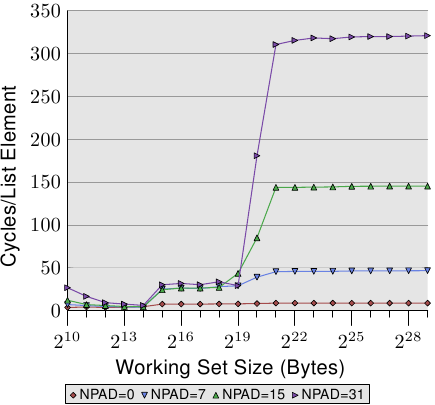

# 3.3.2. cache影响的量测

所有的图表都是由一支能模拟任意大小的工作集、读取与写入存取、以及循序或随机存取的程序所产生的。我们已经在图 3.4 中看过一些结果。这支程序会产生与工作集大小相同、这种型别的阵列：

```c
struct l {
  struct l *n;
  long int pad[NPAD];
};
```

所有的项目都使用 `n` 元素，以循序或是随机的顺序，链结在一个循环的串列中。即使元素是循序排列的，从一个项目前进到下一个项目总是会用到这个指标。`pad` 元素为资料负载（payload），并且能成长为任意大小。在某些测试中，资料会被修改，而在其余的情况中，程序只会执行读取操作。

在效能量测中，我们讨论的是工作集的大小。工作集是由一个 `struct l` 元素的阵列所组成的。一个 2<sup>N</sup> byte的工作集包含 2<sup>N</sup> / `sizeof(struct l)` 个元素。显而易见地，`sizeof(struct l)` 视 `NPAD` 的值而定。以 32 bit的系统来说，`NPAD`=7 代表每个阵列元素的大小为 32 byte，以 64 bit的系统来说，大小为 64 byte。


## 单执行绪循序存取

<figure>
  
  <figcaption>图 3.10：循序读取存取，NPAD=0</figcaption>
</figure>

最简单的情况就是直接走遍串列中的所有项目。串列元素是循序排列、紧密地塞在一起的。不管处理的顺序是正向或反向都无所谓，处理器在两个方向上都能处理得一样好。我们这里 –– 以及在接下来的所有测试中 –– 所要量测的是，处理一个单向串列元素要花多久。时间单位为处理器周期。图 3.10 显示了这个结果。除非有另外说明，否则所有的量测都是在一台 Pentium 4 以 64 bit模式获得的，这表示 `NPAD`=0 的结构 `l` 大小为八byte。

前两个量测结果受到了杂讯的污染。测量的工作量太小了，因而无法过滤掉其余系统的影响。我们能够放心地假设这些值都在 4 个周期左右。考虑到这点，我们能够看到三个不同的水平（level）：

* 工作集大小至多到 2<sup>14</sup> byte。
* 从 2<sup>15</sup> byte到 2<sup>20</sup> byte。
* 2<sup>21</sup> byte以上。

这些阶段能够轻易地解读：处理器拥有一个 16kB L1d 与 1MB L2。我们没有在从一个水平到另一个水平的转变之处看到尖锐的边缘，因为cache也会被系统的其它部分用到，因此cache并不是专门给这支程序的资料所使用的。特别是 L2 cache，它是一个统一式cache（unified cache），也会被用来存放指令（注：Intel 使用包含式cache）。

或许完全没有预期到的是，对于不同工作集大小的实际时间。L1d 命中的时间是预期中的：在 P4 上，L1d 命中之后的载入时间大约是 4 个周期。但 L2 存取怎么样呢？一旦 L1d 不足以保存资料，可以预期这会让每个元素花上 14 个周期以上，因为这是 L2 的存取时间。但结果显示只需要大约 9 个周期。这个差异能够以处理器中的先进逻辑来解释。预期使用连续的memory区域时，处理器会*预取*下一个cache行。这表示，当真的用到下个cache行时，它已经载入一半了。等待下一个cache行载入所需的延迟因而比 L2 存取时间要少得多。

一旦工作集大小成长到超过 L2 的大小，预取的效果甚至更明显。先前我们说过，一次主memory存取要花费 200+ 个周期。只有利用有效的预取，处理器才可能让存取时间维持在低至 9 个周期。如同我们能从 200 与 9 之间的差异所看到的，它的效果很好。

<figure>
  
  <figcaption>图 3.11：循序读取多种大小</figcaption>
</figure>

我们能够在预取的时候 –– 至少间接地 –– 观察处理器。在图 3.11 中，我们看到的是相同工作集大小的时间，但这次我们看到的是不同 `l` 结构大小的曲线。这表示在串列中有比较少、但比较大的元素。不同大小有著令（仍然连续的）串列中的 `n` 元素之间的距离成长的影响。在图中的四种情况，距离分别为 0、56、120、248 byte。

在底部我们可以看到图 3.10 的线，但这时它看起来差不多像是条平坦的线。其它情况的时间要糟得多了。我们也能在这张图中看到三个不同的水平，我们也看到在工作集大小很小的情况下有著很大的误差（再次忽略它们）。只要仅有 L1d 牵涉其中，这些线差不多都相互重合。
There is no prefetching necessary so all element sizes just hit the L1d for each access.

在 L2 cache命中的情况下，我们看到三条新的线相互重合得很好，但它们位在比较高的水平上（大约 28）。这是 L2 存取时间的水平。这表示从 L2 到 L1d 的预取基本上失效了。即使是 `NPAD`=7，我们在回圈的每一次叠代都需要一个新的cache行；以 `NPAD`=0 而言，在需要下一个cache行之前，回圈得叠代八次。预取逻辑无法每个周期都载入一个新的cache行。因此，我们看到的便是在每次叠代时，从 L2 载入的延误。

一旦工作集大小超过 L2 的容量，甚至变得更有趣了。现在四条线全都离得很远。不同的元素大小显然在效能差异上扮演著一个重大的角色。处理器应该要识别出步伐（stride）的大小，不为 `NPAD`=15 与 31 获取不必要的cache行，因为元素的大小是比预取窗（prefetch window）还小的（见 6.3.1 节）。元素大小妨碍预取效果之处，是一个硬件预取限制的结果：它无法横跨分页（page）边界。我们在每次增加大小时，都减少了 50% 硬件排程器（scheduler）的效率。假如硬件预取器（prefetcher）被允许横跨分页边界，并且下一个分页不存在或者无效时，操作系统就得被捲入分页的定位中。这表示程序要经历并非由它自己产生的分页错误（page fault）。这是完全无法接受的，因为处理器并不知道一个分页是不在memory内还是不存在。在后者的情况下，操作系统必须要中断行程。在任何情况下，假定 –– 以 `NPAD`=7 或以上而言 –– 每个串列元素都需要一个cache行，硬件预取器便爱莫能助了。由于处理器一直忙著读取一个word、然后载入下一个元素，根本没有时间去从memory载入资料。

变慢的另一个主要原因是 TLB cache的错失。这是一个储存了从虚拟地址到实体地址的转译结果的cache，如同在第四节所详细解释的那样。由于 TLB cache必须非常地快，所以它非常地小。假如重复存取的分页数比 TLB cache拥有的还多，就必须不断地重算代表著虚拟到实体地址的转译结果的项目。这是一个非常昂贵的操作。对比较大的元素大小而言，一次 TLB 查询的成本是分摊在较少的元素上的。这表示对于每个串列元素，必须要计算的 TLB 项目总数较多。

为了观察 TLB 的影响，我们可以执行一个不同的测试。对于第一个量测，我们像往常一样循序地摆放元素。我们使用 `NPAD`=7 作为占据一整个cache行的元素。对于第二个量测，我们将每个串列元素放置在个别的分页中。每个分页的其余部分维持原样，我们不会将它算在工作集大小的总和中。[^20]结果是，对于第一个量测，每次串列叠代都需要一个新的cache行，并且每 64 个元素一个新的分页。对第二个量测而言，每次叠代都需要载入一个在另一个分页上的cache行。

<figure>
  
  <figcaption>图 3.12：TLB 对循序读取的影响</figcaption>
</figure>

结果可以在图 3.12 中看到。量测都是在与图 3.11 相同的机器上执行的。由于可用 RAM 的限制，工作集大小必须限制在 2<sup>24</sup> byte，其需要 1GB 以将物件放置在个别的分页上。下方的红色曲线正好对应到图 3.11 中的 `NPAD`=7 曲线。我们看到了显示了 L1d 与 L2 cache大小的不同阶段。第二条曲线看起来完全不同。重要的特征是，当工作集大小达到 2<sup>13</sup> byte时开始的大幅飙升。这即是 TLB cache溢出（overflow）的时候了。由于一个元素大小为 64 byte，我们能够计算出 TLB cache有 64 个项目。由于程序锁定了memory以避免它被移出，所以成本不会受分页错误影响。

可以看出，计算实体地址、并将它储存在 TLB 中所花的周期数非常高。图 3.12 中的曲线显示了极端的例子，但现在应该能清楚的一点是，对于较大的 `NPAD` 值而言，一个变慢的重大因素即是 TLB cache效率的降低。由于实体地址必须要在cache行能从 L2 或主memory读取前算出来，因此地址转译的损失就被附加到了memory存取时间上。这在某种程度上解释了，为何每个串列元素在 `NPAD`=31 的总成本会比 RAM 在理论上的存取时间还高的原因。

<figure>
  
  <figcaption>图 3.13：循序读取与写入，NPAD=1</figcaption>
</figure>

我们可以透过观察修改串列元素的测试执行的数据，来一瞥预取实作的多一些细节。图 3.13 显示了三条线。在所有情况中的元素宽度都是 16 byte。第一条线是现在已经很熟悉的串列巡访，它会被当作一条基准线。第二条线 –– 标为「Inc」–– 仅会在前往下一个元素前，增加当前元素的 `pad[0]` 成员的值。第三条线 –– 标为「Addnext0」–– 会取下一个元素的 `pad[0]` 的值，并加到当前串列元素的 `pad[0]` 成员中。

天真的假设大概是「Addnext0」测试跑得比较慢，因为它有更多工作得做。在前进到下一个串列元素之前，就必须载入这个元素的值。这即是看到这个测试实际上 –– 对于某些工作集大小而言 –– 比「Inc」测试还快这点会令人吃惊的原因了。对此的解释是，载入下个串列元素基本上就是一次强制的预取。无论程序在何时前进到下个串列元素，我们都确切地知道这个元素已经在 L1d cache中了。因此我们看到，只要工作集大小能塞进 L2 cache，「Addnext0」就执行得跟单纯的「Follow」一样好。

不过「Addnext0」测试比「Inc」测试更快耗尽 L2。因为它需要从主memory载入更多的资料。这即是在工作集大小为 2<sup>21</sup> byte时，「Addnext0」测试达到 28 个循环水平的原因了。28 循环水平是「Follow」测试所达到的 14 循环水平的两倍高。这也很容易解释。由于其它两个测试都修改了memory，L2 cache为了腾出空间给新的cache行的逐出操作便不能直接把资料丢掉。它必须被写到memory中。这表示 FSB 中的可用频宽被砍了一半，因此加倍了资料从主memory传输到 L2 所花的时间。

<figure>
  
  <figcaption>图 3.14：较大 L2／L3 cache的优势</figcaption>
</figure>

循序、高效的cache管理的最后一个面向是cache的大小。虽然这应该很明显，但仍需要被提出来。图 3.14 显示了以 128 byte元素（在 64 bit机器上，`NPAD`=15）进行 Increment 测试的时间。这次我们看到量测结果来自三台不同的机器。前两台机器为 P4，最后一台为 Core2 处理器。前两台由不同的cache大小来区分它们自己。第一个处理器有一个 32k L1d 与一个 1M L2。第二个处理器有 16k L1d、512k L2、与 2M L3。Core2 处理器有 32k L1d 与 4M L2。

这张图有趣的部分不必然是 Core2 处理器相对于其它两个表现得有多好（虽然这令人印象深刻）。这里主要有兴趣的地方是，工作集大小对于各自的最后一阶cache来说太大、并使得主memory得大大地涉入其中之处。

如同预期，最后一阶的cache越大，曲线在相应于 L2 存取成本的低水平停留得越久。要注意的重要部分是它所提供的效能优势。第二个处理器（它稍微旧了一点）在 2<sup>20</sup> byte的工作集上能够以两倍于第一个处理器的速度执行。这全都归功于最后一阶cache大小的提升。有著 4M L2 的 Core2 处理器甚至表现得更好。

对于随机的工作量而言，这可能不代表什么。但若是工作量能被裁剪成最后一阶cache的大小，程序效能便能够极为大幅地提升。这也是有时候值得为拥有较大cache的处理器花费额外金钱的原因。


## 单执行绪随机存取

我们已经看过，处理器能够借由预取cache行到 L2 与 L1d，来隐藏大部分主memory、甚至是 L2 的存取等待时间。不过，这只有在能够预测memory的存取时才能良好运作。

<figure>
  
  <figcaption>图 3.15：循序 vs 随机读取，NPAD=0</figcaption>
</figure>

若是存取模式是不可预测、或者随机的，情况便大大地不同。图 3.15 比较了循序存取每个串列元素的时间（如图 3.10）以及当串列元素是随机分布在工作集时的时间。顺序是由随机化的链结串列所决定的。没有让处理器能够确实地预取资料的方法。只有一个元素偶然在另一个在memory中也彼此邻近的元素不久之后用到，这才能起得了作用。

在图 3.15 中，有两个要注意的重点。第一点是，增长工作集大小需要大量的周期数。机器能够在 200-300 个周期内存取主memory，但这里我们达到了 450 个周期以上。我们先前已经看过这个现象了（对比图 3.11）。自动预取在这里实际上起了反效果。

<figure>
  
  <figcaption>图 3.16：L2d 错失率</figcaption>
</figure>

第二个有趣的地方是，曲线并不像在循序存取的例子中那样，在多个平缓阶段变得平坦。曲线持续上升。为了解释这点，我们能够针对不同的工作集大小量测程序的 L2 存取次数。结果能够在图 3.16 与表 3.2 看到。

图表显示，当工作集大小大于 L2 的大小时，cache错失率（L2 存取数 / L2 错失数）就开始成长了。这条曲线与图 3.15 的曲线有著相似的形式：它快速地上升、略微下降、然后再度开始上升。这与每串列元素所需循环数的曲线图有著密切的关联。L2 错失率最终会一直成长到接近 100% 为止。给定一个足够大的工作集（以及 RAM），任何随机选取的cache行在 L2 或是载入过程中的机率便能够被随心所欲地降低。

<figure>
  <table>
    <tr>
      <th rowspan="2">集合大小</th>
      <th colspan="5">循序</th>
      <th colspan="5">随机</th>
    </tr>
    <tr>
      <th>L2 命中数</th>
      <th>L2 错失数</th>
      <th>叠代次数</th>
      <th>错失／命中比率</th>
      <th>每叠代 L2 存取数</th>
      <th>L2 命中数</th>
      <th>L2 错失数</th>
      <th>叠代次数</th>
      <th>错失／命中比率</th>
      <th>每叠代 L2 存取数</th>
    <tr>
      <td>2<sup>20</sup></td>
      <td>88,636</td>
      <td>843</td>
      <td>16,384</td>
      <td>0.94%</td>
      <td>5.5</td>
      <td>30,462</td>
      <td>4721</td>
      <td>1,024</td>
      <td>13.42%</td>
      <td>34.4</td>
    </tr>
    <tr>
      <td>2<sup>21</sup></td>
      <td>88,105</td>
      <td>1,584</td>
      <td>8,192</td>
      <td>1.77%</td>
      <td>10.9</td>
      <td>21,817</td>
      <td>15,151</td>
      <td>512</td>
      <td>40.98%</td>
      <td>72.2</td>
    </tr>
    <tr>
      <td>2<sup>22</sup></td>
      <td>88,106</td>
      <td>1,600</td>
      <td>4,096</td>
      <td>1.78%</td>
      <td>21.9</td>
      <td>22,258</td>
      <td>22,285</td>
      <td>256</td>
      <td>50.03%</td>
      <td>174.0</td>
    </tr>
    <tr>
      <td>2<sup>23</sup></td>
      <td>88,104</td>
      <td>1,614</td>
      <td>2,048</td>
      <td>1.80%</td>
      <td>43.8</td>
      <td>27,521</td>
      <td>26,274</td>
      <td>128</td>
      <td>48.84%</td>
      <td>420.3</td>
    </tr>
    <tr>
      <td>2<sup>24</sup></td>
      <td>88,114</td>
      <td>1,655</td>
      <td>1,024</td>
      <td>1.84%</td>
      <td>87.7</td>
      <td>33,166</td>
      <td>29,115</td>
      <td>64</td>
      <td>46.75%</td>
      <td>973.1</td>
    </tr>
    <tr>
      <td>2<sup>25</sup></td>
      <td>88,112</td>
      <td>1,730</td>
      <td>512</td>
      <td>1.93%</td>
      <td>175.5</td>
      <td>39,858</td>
      <td>32,360</td>
      <td>32</td>
      <td>44.81%</td>
      <td>2,256.8</td>
    </tr>
    <tr>
      <td>2<sup>26</sup></td>
      <td>88,112</td>
      <td>1,906</td>
      <td>256</td>
      <td>2.12%</td>
      <td>351.6</td>
      <td>48,539</td>
      <td>38,151</td>
      <td>16</td>
      <td>44.01%</td>
      <td>5,418.1</td>
    </tr>
    <tr>
      <td>2<sup>27</sup></td>
      <td>88,114</td>
      <td>2,244</td>
      <td>128</td>
      <td>2.48%</td>
      <td>705.9</td>
      <td>62,423</td>
      <td>52,049</td>
      <td>8</td>
      <td>45.47%</td>
      <td>14,309.0</td>
    </tr>
    <tr>
      <td>2<sup>28</sup></td>
      <td>88,120</td>
      <td>2,939</td>
      <td>64</td>
      <td>3.23%</td>
      <td>1,422.8</td>
      <td>81,906</td>
      <td>87,167</td>
      <td>4</td>
      <td>51.56%</td>
      <td>42,268.3</td>
    </tr>
    <tr>
      <td>2<sup>29</sup></td>
      <td>88,137</td>
      <td>4,318</td>
      <td>32</td>
      <td>4.67%</td>
      <td>2,889.2</td>
      <td>119,079</td>
      <td>163,398</td>
      <td>2</td>
      <td>57.84%</td>
      <td>141,238.5</td>
    </tr>
  </table>
  <figcaption>表 3.2：循序与随机巡访时的 L2 命中与错失，NPAD=0</figcaption>
</figure>

光是cache错失率的提高就能够解释一部分成本。但有著另一个因素。看看表 3.2，我们能够看到在 L2 / 叠代数那栏，程序每次叠代所使用的 L2 总数都在成长。每个工作集都是前一个的两倍大。所以，在没有cache的情况下，我们预期主memory的存取次数会加倍。有了cache以及（几乎）完美的可预测性，我们看到显示在循序存取的数据中，L2 使用次数增长得很保守。其增长除了工作集大小的增加以外，就没有别的原因了。

<figure>
  
  <figcaption>图 3.17：逐页（page-wise）随机化，NPAD=7</figcaption>
</figure>

对于随机存取，每次工作集大小加倍的时候，每个元素的存取时间都超过两倍。这表示每个串列元素的平均存取时间增加了，因为工作集大小只有变成两倍而已。背后的原因是 TLB 错失率提高了。在图 3.17 中，我们看到在 `NPAD`=7 时随机存取的成本。只是这次，随机化的方式被修改了。一般的情况下，是将整个串列作为一个区块（block）随机化（以标签〔label〕 $$ \infty $$ 表示），而其它的 11 条曲线则表示在比较小的区块内进行随机化。标记为「60」的曲线，代表每组由 60 个分页（245,760 byte）组成的集合会分别进行随机化。这表示在走到下一个区块的元素之前，会先巡访过所有区块内的串列元素。这使得在任何一个时间点使用的 TLB 项目的数量有所限制。

在 `NPAD`=7 时的元素大小为 64 byte，这与cache行大小一致。由于串列元素的顺序被随机化了，因此硬件预取器不大可能有任何效果，尤其在有一堆元素的情况下。这表示 L2 cache的错失率与在一个区块内的整个串列随机化相比并不会有显著地不同。测试的效能随著区块大小增加而逐渐地逼近单一区块随机化的曲线。这表示后者的测试案例的效能显著地受到了 TLB 错失的影响。假如 TLB 错失次数能够降低，效能便会显著地提升（在我们稍候将会看到的测试中，高达 38%）。


[^20]: 是的，这有点不一致，因为在其它的测试中，我们把结构中没用到的部分也算在元素大小里，而且我们能够定义 `NPAD` 以让每个元素填满一个分页。在这种情况中，工作集的大小会差得很多。不过这并不是这个测试的重点，而且无论如何预取都没什么效率，因此没有什么差别。

