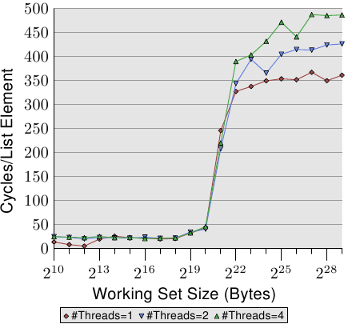
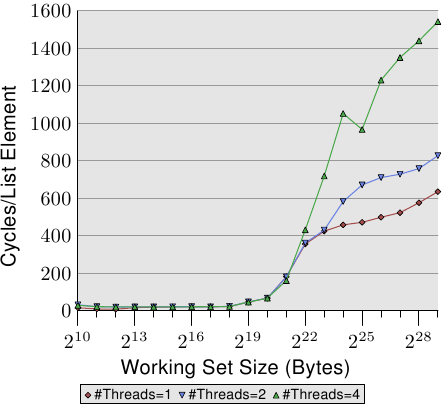
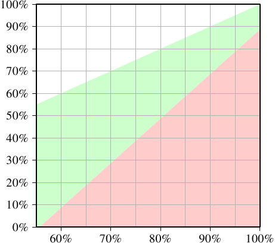

# 3.3.4. 多处理器支援

在上一节，我们已经指出，当多处理器开始起作用时我们会遇到的问题。多核处理器甚至有那些并没有被共享的cache层级（至少 L1d）的问题。

提供从一个处理器到另一个处理器的cache的直接存取是完全不切实际的。首先，连线根本不够快。实际的替代方案是，将cache内容传输给另一个处理器 –– 假如需要的话。注意到这也同样适用于不在相同处理器上共享的cache。

现在的问题是，什么时候得传输这个cache行？这是个相当容易回答的问题：当一个处理器需要读取或写入一个cache行，而其在另一个处理器的cache上是脏的。但处理器要怎么样才能判断一个cache行在另一个处理器的cache上是脏的呢？仅因为一个cache行被另一个处理器载入就假定如此，（至多）也是次佳的（suboptimal）。通常，大多数的memory存取都是读取操作，产生的cache行也不是脏的。处理器对cache行的操作是很频繁的（那当然，不然我们怎么会有这篇论文？），这表示在每次写入操作之后，都去广播被改变的cache行的资讯是不切实际的。

这些年来所发展出来的就是 MESI cache一致性协议（修改〔Modified〕、独占〔Exclusive〕、共享〔Shared〕、无效〔Invalid〕）。这个协议的名称来自采用 MESI 协议时、一个cache行能够变成的四个状态：

<dl>
  <dt>修改</dt>
  <dd>本地的处理器已经修改过cache行。这也暗指它是在任何cache中的唯一副本。</dd>

  <dt>独占</dt>
  <dd>cache行没有被修改过，但已知没有被载入到任何其它处理器的cache中。</dd>

  <dt>共享</dt>
  <dd>cache行没有被修改过，并且可能存在于另一个处理器的cache中。</dd>

  <dt>无效</dt>
  <dd>cache行是无效的 –– 也就是说，没有被使用。</dd>
</dl>

多年来，这个协议从比较不复杂、但也比较没效率的较简易版本开始发展。有了这四个状态，便可能有效率地实作回写式cache，而又支援同时在不同的处理器上使用唯读的资料。

<figure>
  
  <figcaption>图 3.18：MESI 协议的状态转换</figcaption>
</figure>

借由处理器监听 –– 或者窥探 –– 其它处理器的运作，不用太多精力便得以完成状态改变。处理器执行的某些操作会被发布在外部针脚上，因而让处理器的cache处理能被外界看到。处理中的cache行地址能在地址总线上看到。在接下来对状态与其转换（显示在图 3.18）的描述中，我们会指出总线是何时被牵扯进来的。

起初所有cache行都是空的，因此也是**无效**的。若是资料是为了写入而载入cache，则改为**修改**。若是资料是为了读取而载入，新的状态则取决于另一个处理器是否也已载入这个cache行。如果是的话，新的状态为**共享**，否则为**独占**。

若是一个**修改**的cache行从本地处理器被读取或写入，这个指令能够使用当前的cache内容，并且状态不变。若是第二个处理器想要读取这个cache行，第一个处理器就必须将它的cache内容寄送给第二个处理器，然后它就能将状态改为**共享**。寄送给第二个处理器的资料也会被memory控制器接收并处理，其会将内容储存在memory中。假如没有这么做，cache行就不能被标为**共享**。若是第二个处理器想要写入cache行，第一个处理器便会寄送cache行的内容，并将自己的cache行标为**无效**。这即是恶名昭彰的「所有权请求（Request For Ownership，RFO）」操作。在最后一个层级的cache中执行这个操作，就像是 I→M 的转换一样，相当昂贵。对直写式cache而言，我们也得加上它将新的cache行内容写入到更高阶cache或主memory所花费的时间，进而提高了成本。

若是一个cache行处于**共享**状态，并且本地处理器要读取它，那么就不必改变状态，读取请求能够由这个cache来达成。若是cache行要在本地写入，也能够使用这个cache行，但状态会被改成**修改**。这也需要令其它处理器的所有可能的cache行副本被标为**无效**。因此，写入操作必须要透过一个 RFO 讯息发布给其它处理器。若是cache行被第二个处理器请求读取，那么什么也不必做。主memory包含了当前的资料，本地的状态也已经是**共享**了。在第二个处理器想要写入到cache行的情况下（RFO），就直接将cache行标为**无效**。不需要总线操作。

**独占**状态与**共享**状态大致相同，只有一个重大的不同：本地的写入操作不必发布到总线上。因为已经知道本地cache是唯一一个持有这个独有的cache行的了。这会是一个巨大的优势，所以处理器会试著令尽可能多的cache行维持在**独占**状态，而非**共享**。后者是在这种时刻，无法取得这个资讯的退而求其次。**独占**状态也能够在完全不引发功能问题的情况下被省去。唯一会变糟的只有效能，因为 E→M 转换比 S→M 转换要快得多了。

从这些状态转换的描述中，应该很清楚多处理器操作特有的成本在哪了。是的，填入cache仍旧昂贵，但现在我们也必须留意 RFO 讯息。每当必须发送这种讯息时，工作就会变慢。

有两种必须要 RFO 讯息的情况：

* 一条执行绪从一个处理器迁移到另一个，并且所有cache行都必须一起移动到新的处理器上。
* 一个cache行真的被两个不同的处理器所需要。[^21]

在多执行绪或多行程的程序中，总是有一些同步的需求；这种同步是使用memory实作的。所以有些有根据的 RFO 讯息。它们仍旧得尽可能地降低频率。不过，还有其他 RFO 讯息的来源。我们将会在第六节解释这些情况。cache一致性协议的讯息必须被分发给系统中的处理器。MESI 转换直到确定系统中的所有处理器都有机会回覆讯息之前都不会发生。这表示一个回覆能花上的最长可能时间决定了一致性协议的速度。[^22]可能会有总线上的冲突、NUMA 系统的等待时间会很长、而且突发的流量当然也会让事情变慢。这全都是专注在避免不必要流量的好理由。

还有一个与拥有多于一个处理器有关的问题。这个影响是与机器高度相关的，但原理上这个问题总是存在：FSB 是一个共享的资源。在大多数机器上，所有处理器会透过单一一条总线连结到memory控制器（见图 2.1）。假如单一个处理器能够占满总线（通常是这样），那么共享相同总线的二或四个处理器甚至会更加地限制每个处理器的可用频宽。

即使每个处理器都如图 2.2 一样，有它自己的、连结到memory控制器的总线，但仍旧有连结到memory模组的总线。通常这是唯一一条总线，而 –– 即使在图 2.2 的扩充模型中 –– 同时存取相同的memory模组将会限制频宽。

每个处理器都能拥有本地memory的 AMD 模型亦是如此。所有处理器确实能快速地并行存取它们的本地memory，尤其在使用整合式memory控制器的情况。但多执行绪与多行程程序 –– 至少偶尔 –– 必须存取相同的memory区域以进行同步。

并行是受可用于必要的同步实作的有限频宽所严重地限制的。程序需要被小心地设计，以将不同处理器核对相同memory位置的存取降到最小。接下来的量测将会显示这点、以及其它与多执行绪程序有关的cache影响。

## 多执行绪存取

为了确保大家理解在不同处理器上同时使用相同cache行所引入的问题的严重性，我们将会在这里多看到一些针对我们先前用过的相同程序的效能图表。不过，这次会同时执行多于一条执行绪。所要量测的是最快的执行绪的执行时间。这意味著完成所有执行绪的完整执行时间还会更长。使用的机器有四个处理器；测试使用至多四条执行绪。所有处理器共享连结到memory控制器的总线，而且仅有一条连结到memory模组的总线。

<figure>
  
  <figcaption>图 3.19：循序读取，多条执行绪</figcaption>
</figure>

图 3.19 显示了循序唯读存取 128 byte项目的效能（在 64 bit机器上，`NPAD`=15）。对于单执行绪的曲线，我们能预期是条与图 3.11 相似的曲线。量测使用了一台不同的机器，所以实际的数字会有所不同。

这张图中重要的部分当然是执行多条执行绪时的行为。注意到在走访链结串列时，没有memory会被修改，亦无让执行绪保持同步的企图。尽管不必有 RFO 讯息、而且所有的cache行都能被共享，但我们看到当使用两条执行绪时，效能减低了高达 18%，而使用四条执行绪时则高达 34%。由于没有必须在处理器之间传输的cache行，因此变慢仅仅是由两个瓶颈中的一或二者所引起的：从处理器到memory控制的共享总线、以及从memory控制器到memory模组的总线。一旦工作集大小大于这台机器的 L3 cache，图上三种数量的执行绪都会预取新的串列元素。即便只有两条执行绪，可用频宽也不足以线性延展（scale）（即，没有执行多条执行绪带来的损失）。

<figure>
  
  <figcaption>图 3.20：循序 Increase，多条执行绪</figcaption>
</figure>

当我们修改memory时，情况变得更可怕了。图 3.20 显示了循序 Increase 测试的结果。这个图表的 Y 轴使用了对数尺度。所以，别被看似很小的差异给骗了。我们在执行两条执行绪的时候仍有大约 18% 的损失，而执行四条执行绪则是惊人的 93% 损失。这表示，在使用四条执行绪时，预取流量加上回写流量就把总线占得非常满了。

我们使用对数尺度来显示 L1d 范围的结果。能够看到的是，一旦执行了多于一条执行绪，L1d 基本上就没什么效果了。只有在 L1d 不足以容纳工作集的时候，单执行绪的存取时间才会超过 20 个周期。当执行了多条执行绪时，存取时间却立即就达到了 –– 即便使用的是最小的工作集大小。

这里没有显示出问题的一个面向。这个特定的测试程序是难以量测的。即使测试修改了memory、而我们因此预期必定会有 RFO 讯息，但当使用了多于一条执行绪时，我们并没有在 L2 范围内看到更高的成本。程序必须要使用大量的memory，并且所有执行绪必须要平行地存取相同的memory。没有大量的同步 –– 其会占据大多的执行时间 –– 这是很难实现的。

<figure>
  
  <figcaption>图 3.21：随机 Addnextlast，多条执行绪</figcaption>
</figure>

最后在图 3.21，我们有 Addnextlast 测试以随机的方式存取memory的数据。提供这张图主要是为了显示出这些高得吓人的数字。现在在极端的状况下，处理一个单一的串列元素要花上大约 1,500 个周期。使用更多执行绪的情况还要更加严重。我们能使用一张表格来总结多条执行绪的效率。

<figure>
  <table>
    <tr>
      <th>#执行绪</th>
      <th>循序读取</th>
      <th>循序递增</th>
      <th>随机增加</th>
    </tr>
    <tr>
      <td>2</td>
      <td>1.69</td>
      <td>1.69</td>
      <td>1.54</td>
    </tr>
    <tr>
      <td>4</td>
      <td>2.98</td>
      <td>2.07</td>
      <td>1.65</td>
    </tr>
  </table>
  <figcaption>表 3.3：多条执行绪的效率</figcaption>
</figure>

表格显示了在图 3.19、3.20、与 3.21 中，多执行绪以最大工作集大小执行的效率。数据表示在使用二或四条执行绪处理最大的工作集大小时，测试程序可能达到的最佳加速。以两条执行绪而言，加速的理论极限为 2，对于四条执行绪而言为 4。两条执行绪的数据并没有那么糟。但对于四条执行绪，最后一个测试的数据显示了，几乎不值得扩展到超过两条执行绪。额外的获益是非常小的。如果我们以略为不同的方式表示图 3.21 的资料，我们便能更轻易地看出这点。

<figure>
  
  <figcaption>图 3.22：经由平行化的加速</figcaption>
</figure>

图 3.22 的曲线显示了加速因子 –– 也就是相比于以单一执行绪执行的程序的相对效能。我们得忽略最小大小的情况，因为量测结果不够精确。以 L2 与 L3 cache的范围而言，我们能够看到我们确实达到了几乎是线性的加速。我们分别达到了差不多 2 与 4 倍速。但一旦 L3 cache不足以容纳工作集，数字就往下掉了。两条与四条执行绪的加速因子都掉到一样的值（见表 3.3 的第四行）。这是难以找到主机板有著超过四个全都使用同个memory控制器的 CPU 插槽的其中一个理由。有著更多处理器的机器必须要以不同的方式来做（见第五节）。

这些数字并不普遍。在某些情况下，甚至连能塞进最后一阶cache的工作集都无法做到线性加速。事实上，这才是常态，因为执行绪通常并不若这个测试程序的例子一般解耦（decoupled）。另一方面，是可能运作在大工作集上，而仍旧拥有多于两条执行绪的优势的。不过，做到这点需要一些思考。我们会在第六节讨论一些方法。

## 特例：Hyper-Threading

Hyper-Threading (简称 HT，有时被称为对称多执行绪〔Symmetric Multi-Threading，SMT〕）由 CPU 实作，并且是个特例，因为个别执行绪无法真的同时执行。它们全都共享著暂存器集以外、几乎所有的处理资源。个别的处理器核与 CPU 仍然平行地运作，但实作在每颗处理器核上的执行绪会受到这个限制。理论上，每颗处理器核可以有许多执行绪，但是 –– 到目前为止 –– Intel CPU 的每颗处理器核至多仅有两条执行绪。CPU 有时域多工（time-multiplex）执行绪的职责。不过单是如此并没太大意义。实际的优点是，当同时执行的 HT 被延迟时，CPU 可以调度另一条 HT ，并善用像是算数逻辑一类的可用资源。在大多情况下，这是由memory存取造成的延迟。

假如两条执行绪执行在一颗 HT 核上，那么只有在两条执行绪*合并的（combined）*执行时间小于单执行绪程序的执行时间时，程序才会比单执行绪程序还有效率。借由重叠经常重复发生的不同memory存取的等待时间，这是可能的。一个简单的计算显示了为了达到某程度的加速，cache命中率的最小需求。

一支程序的执行时间能够以一个仅有一层cache的简易模型来估算，如下（见 [16]）：

$$
T_{\text{exe}} = N [ (1 - F_{\text{mem}}) T_{\text{proc}} + F_{\text{mem}} (G_{\text{hit}} T_{\text{cache}} + (1 - G_{\text{hit}}) T_{\text{miss}}) ]
$$

变数的意义如下：

$$
\begin{aligned}
N &= \text{指令数} \\
F_{\text{mem}} &= N \text{ 次中存取memory的比率} \\
G_{\text{hit}} &= \text{载入次数中命中cache的比率} \\
T_{\text{proc}} &= \text{每个指令的周期数} \\
T_{\text{cache}} &= \text{cache命中的周期数} \\
T_{\text{miss}} &= \text{cache错失的周期数} \\
T_{\text{exe}} &= \text{程序执行时间}
\end{aligned}
$$

为了要让使用两条执行绪有任何意义，两条执行绪任一的执行时间都必须至多为单执行绪程序码的一半。在任一边的唯一变数为cache命中的数量。若是我们求解方程序，以得到令执行绪的执行不减慢超过 50% 以上所需的最小cache命中率，我们会得到图 3.23 的结果。

<figure>
  
  <figcaption>图 3.23：加速的最小cache命中率</figcaption>
</figure>

输入 –– 刻在 X 轴上 –– 为单执行绪程序码的cache命中率 $$ G_{\text{hit}} $$。Y 轴显示了多执行绪程序码的cache命中率。这个值永远不能高于单执行绪的命中率，不然单执行绪程序码也会使用这个改良的程序码。以单执行绪的命中率 –– 在这个特定的情况下 –– 低于 55% 而言，在所有情况下程序都能够因为使用执行绪而获益。由于cache错失，CPU 或多或少有足够的空闲来执行第二条 HT。

绿色的区域是目标。假如对执行绪而言的减慢小于 50%，且每条执行绪的工作量都减半，那么合并的执行时间就可能会小于单执行绪的执行时间。以用作模型的处理器（使用一个有著 HT 的 P4 的数据）而言，一支命中率为 60% 的单执行绪程序，对双执行绪程序来说需要至少 10% 的命中率。这通常是做得到的。但若是单执行绪程序的命中率为 95%，那么多执行绪程序就需要至少 80% 的命中率。这更难了。尤其 –– 这是使用 HT 的问题 –– 因为现在每条 HT 可用的有效cache大小（这里是 L1d，在实际上 L2 也是如此）被砍半了。 HT 都使用相同的cache来载入它们的资料。若是两条执行绪的工作集没有重叠，那么原始的 95% 命中率也会打对折，因而远低于所需要的 80%。

HT 因而只有在有限范围的情境中有用。单执行绪程序的cache命中率必须足够低，以在给定上面的等式、以及减小的cache大小时，新的命中率仍然满足要求。这时，也只有这时，才有任何使用 HT 的意义。实际上结果是否比较快，取决于处理器是否足以能将一条执行绪的等待时间重叠在另一条执行绪的执行时间上。平行化程序码的间接成本必须被加到新的总执行时间上，这个额外成本经常无法忽视。

在 6.3.4 节，我们将会看到一种执行绪紧密合作、而通过共有cache的紧密耦合竟然是个优点的技术。这个技术能够用于多种情境，只要程序开发者乐于将时间与精力投入到扩展他们的程序码的话。

应该清楚的是，假如两条 HT 执行完全不同的程序码（也就是说，两条硬件执行绪被操作系统如同单独的处理器一般对待，以执行个别的行程），cache大小固然会减半，这表示cache错失的显著攀升。除非cache足够大，不然这种操作系统排程的实行是有问题的。除非机器由行程组成的负载确实 –– 经由它们的设计 –– 能够获益于 HT ，否则最好在电脑的 BIOS 把 HT 关掉。[^23]

[^21]: 以相同处理器上的两颗处理器核而言，在较小的层级也是如此。成本只小了一点点。RFO 讯息可能会被多次送出。

[^22]: 这即是为何我们现今会看到 –– 举例来说 –– 有三个插槽的 AMD Opteron 系统的原因。假定处理器只拥有三条超连结（hyperlink），而且一条是北桥连接所需，每个处理器都正好相隔一跳（hop）。

[^23]: 另一个令 HT 维持开启的理由是除错。SMT 令人惊讶地善于在平行程序中找出好几组问题。

