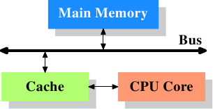
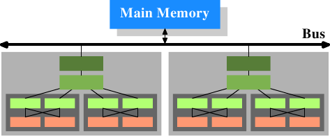

# 3.1. 概观 CPU cache

在深入 CPU cache的技术细节之前，某些读者或许会发现，先理解cache是如何融入现代电脑系统的「大局（big picture）」是有所帮助的。

<figure>
  
  <figcaption>图 3.1：最简易的cache配置</figcaption>
</figure>

图 3.1 显示了最简易的cache配置。其与能在早期找到的、采用 CPU cache的系统架构是一致的。CPU 核不再直接连结到主memory。[^16]所有的载入与储存都必须经过cache。CPU 核与cache之间的连线是一条特殊的、快速的连线。在这个简化的示意图上，主memory与cache都被连结到系统总线，其也会用来跟其它系统元件通讯。我们已经以「FSB」介绍过系统总线，这是它现今使用的名称；见 2.2 节。在这一节中，我们会省略北桥；假定它存在，以方便 CPU 与主memory的沟通。

即便过去数十年来的大多电脑都采用冯纽曼架构（von Neumann architecture），**但实验证实分离程序码与资料的cache是比较好的**。Intel 自 1993 年起采用分离程序码与资料的cache，就再也没有回头过。程序码与资料所需的memory区域彼此相当独立，这也是独立的cache运作得更好的原因。近年来，另一个优点逐渐浮现：对大多数常见的处理器而言，指令解码（decoding）的步骤是很慢的；cache解码过的指令能够让执行加速，在不正确地预测或者无法预测的分支（branch）使得管线（pipeline）为空的情况下尤其如此。

在引入cache之后不久，系统变得越来越复杂。cache与主memory之间的速度差异再次增加，直到加入了另一层级的cache，比起第一层cache来得更大也更慢。仅仅提升第一层cache的大小，以经济因素来说并非一个可行的办法。今日，甚至有正常使用、具有三层cache的机器。具有这种处理器的系统看起来就像图 3.2 那样。随著单一 CPU 中的核数增加，未来cache层级也许会变得更多。

<figure>
  
  <figcaption>图 3.2：具有三层cache的处理器</figcaption>
</figure>

图 3.2 显示了三层cache，并引入了我们将会在本文其余部分使用的术语。L1d 是一阶资料cache、L1i 是一阶指令cache等等。注意，这只是张示意图；实际上资料流从处理器核到主memory的路上并不需要通过任何较高层级的cache。CPU 设计者在cache介面的设计上有著很大的自由。对程序开发者来说，是看不到这些设计上的抉择的。

此外，我们有多核的处理器，每个处理器核都能拥有多条「执行绪」(thread)。一个处理器核与一条执行绪的差别在于，不同的处理器核拥有（几乎[^17]）所有硬件资源各自的副本。除非同时用到相同的资源 –– 像是对外连线，否则处理器核是能够完全独立运作的。另一方面，执行绪则共享几乎所有处理器的资源。Intel 的执行绪实作只让其拥有个别的暂存器，甚至还是有限的 –– 某些暂存器是共享的。所以，现代 CPU 的完整架构看起来就像图 3.3。

<figure>
  
  <figcaption>图 3.3：多处理器、多核、多执行绪</figcaption>
</figure>

在这张图中，我们有两颗处理器，每颗两个核，各自拥有两个执行绪。执行绪共享一阶cache。处理器核（以深灰色为底）拥有独立的一阶cache。所有 CPU 核共享更高层级的cache。两颗处理器（两个浅灰色为底的大方块）自然不会共享任何cache。这些全都很重要，在我们讨论cache对多行程与多执行绪应用程序的影响时尤为如此。

[^16]: 在更早期的系统中，cache是如同 CPU 与主memory一样接到系统总线上的。这比起实际的解法，更像是一种临时解（hack）。

[^17]: 早期的多核处理器甚至有分离的第 2 阶cache (L2)，且无第 3 阶cache。

