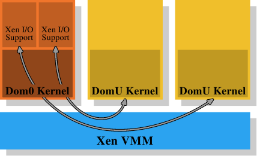

# 4.4. 虚拟化的影响

操作系统映像（image）的虚拟化会变得越来越流行；这表示memory管理的另一层会被加到整体中。行程（基本上为监狱〔jail〕）或操作系统容器（container）的虚拟化并不属于这个范畴，因为只有一个操作系统会牵涉其中。像 Xen 或 KVM 这类技术能够 –– 无论有没有来自处理器的协助 –– 执行独立操作系统映像。在这些情况下，只有一个直接控制实体memory存取的软件。

<figure>
  
  <figcaption>图 4.4：Xen 虚拟化模型</figcaption>
</figure>

在 Xen 的情况下（见图 4.4），Xen VMM 即是这个软件。不过 VMM 本身并不实作太多其它的硬件控制。不若在其它较早期的系统（以及首次释出的 Xen VMM）上的 VMM，除了memory与处理器之外的硬件是由具有特权的 Dom0 域所控制的。目前，这基本上是与没有特权的 DomU 系统核心相同的系统核心，而且 –– 就所关心的memory管理而言 –– 它们没什么区别。重要的是，VMM 将实体memory分发给了 Dom0 与 DomU 系统核心，其因而实作了普通的memory管理，就好像它们是直接执行在一个处理器上一样。

为了实现完成虚拟化所需的域的分离，Dom0 与 DomU 系统核心中的memory处理并不具有无限制的实体memory存取。VMM 不是借由分发独立的实体分页、并让客户端操作系统处理定址的方式来分发memory；这不会提供任何针对有缺陷或者流氓客户域的防范。取而代之地，VMM 会为每个客户域建立它自己拥有的分页表树，并使用这些资料结构来分发memory。好处是能够控制对分页表树的管理资讯的存取。若是程序没有合适的权限，它就什么也无法做。

这种存取控制被利用在 Xen 提供的虚拟化之中，无论使用的是半虚拟化（paravirtualization）或是硬件虚拟化（亦称全虚拟化）。客户域采用了有意与半虚拟化以及硬件虚拟化十分相似的方式，为每个行程建立了它们的分页表树。无论客户端操作系统在何时修改了它的分页表，都会呼叫 VMM。VMM 于是使用在客户域中更新的资讯来更新它自己拥有的影子分页表。这些是实际被硬件用到的分页表。显然地，这个过程相当昂贵：分页表树每次修改都需要一次 VMM 的呼叫。在没有虚拟化的情况下对memory映射的更动并不便宜，而它们现在甚至变得更昂贵了。

考虑到从客户端操作系统到 VMM 的更改并返回，它们本身已经非常昂贵，额外的成本可能非常大。这即是为何处理器开始拥有额外的功能，以避免影子分页表的建立。这很好，不仅因为速度的关系，它也减少了 VMM 的memory消耗。Intel 有扩充分页表（Extended Page Table，EPT），而 AMD 称它为巢状分页表（Nested Page Table，NPT）。基本上这两个技术都拥有客户端操作系统从「客户虚拟地址（guest virtual address）」产生「宿主虚拟地址（host virtual address）」的分页表。宿主虚拟地址接著必须被进一步 –– 使用每个域的 EPT／NPT 树 –– 转译成真正的实体地址。这会令memory处理以几乎是非虚拟化情况的速度来进行，因为大多数memory管理的 VMM 项目都被移除了。它也减少了 VMM 的memory使用，因为现在每个域（对比于行程）都仅有一个必须要维护的分页。

这个额外的地址转译步骤的结果也会储存在 TLB 中。这表示 TLB 不会储存虚拟的实体地址，而是查询的完整结果。已经解释过 AMD 的 Pacifica 扩充引入了 ASID 以避免在每个项目上的 TLB 冲出。ASID 的bit数量在最初释出的处理器扩充中只有一位；这足以区隔 VMM 与客户端操作系统了。Intel 拥有用于相同目的的虚拟处理器 ID（virtual processor ID，VPID），只不过有更多的bit数。但是对于每个客户域而言，VPID 都是固定的，因此它无法被用来标记个别的行程，也不能在这个层级避免 TLB 冲出。

每次定址空间修改所需的工作量是有著虚拟化操作系统的一个问题。不过，基于 VMM 的虚拟化还有另一个固有的问题：没有办法拥有两层memory处理。但是memory处理很难（尤其在将像 NUMA 这类难题纳入考虑的时候，见第五节）。Xen 使用一个分离 VMM 的方式使得最佳化的（甚至是好的）处理变得困难，因为所有的memory管理实作的难题 –– 包含像memory区域的探寻这类「琐碎」事 –– 都必须在 VMM 中重复。操作系统拥有成熟且最佳化的实作；真的应该避免重复这些事。

<figure>
  
  <figcaption>图 4.5：KVM 虚拟化模型</figcaption>
</figure>

这即是为何废除 VMM／Dom0 模型是个如此有吸引力的替代方案。图 4.5 显示了 KVM Linux 系统核心扩充是如何试著解决这个问题的。没有直接执行在硬件上、并控制所有客户的分离 VMM；而是一个普通的 Linux 系统核心接管了这个功能。这表示在 Linux 系统核心上完整且精密的memory处理功能被用来管理系统中的memory。客户域与被创造者称为「客户模式（guest mode）」的普通的使用者层级行程一同执行。虚拟化功能 –– 半虚拟化或全虚拟化 –– 是由 KVM VMM 所控制。这只不过是另一个使用者层级的行程，使用系统核心实作的特殊 KVM 装置来控制一个客户域。

这个模型相较于 Xen 模型的分离 VMM 的优点是，即使在使用客户端操作系统时仍然有两个运作的memory处理者，但只需要唯一一种在 Linux 系统核心中的实作。没有必要像 Xen VMM 一样在另一段程序码中重复相同的功能。这导致更少的工作、更少的臭虫、以及 –– 也许 –– 更少两个memory管理者接触的摩擦，因为在一个 Linux 客户端中的memory管理者会与外部在裸机上执行的 Linux 系统核心的memory管理者做出相同的假设。

总而言之，程序开发者必须意识到，采用虚拟化的时候，cache错失（指令、资料、或 TLB）的成本甚至比起没有虚拟化还要高。任何减少这些工作的最佳化，在虚拟化的环境中甚至会获得更多的回报。处理器设计者将会 –– 随著时间的推移 –– 透过像是 EPT 与 NPT 这类技术来逐渐减少这个差距，但它永远也不会完全消失。

