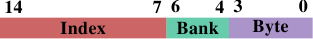

# 6.2.1. 最佳化一阶资料cache存取

在 3.3 节，我们已经看过 L1d cache的有效使用能够提升效能。在这一节，我们会展示什么样的程序码改变能够协助改进这个效能。延续前一节，我们首先聚焦在循序存取memory的最佳化。如同在 3.3 节中看到的数字，处理器在memory被循序存取的时候会自动预取资料。

使用的范例程序码为矩阵乘法。我们使用两个 $$ 1000 \times 1000 $$ `double` 元素的方阵（square matrices）。对于那些忘记数学的人，给定元素为 $$ a_{ij} $$ 与 $$ b_{ij} $$ 的矩阵 $$ A $$ 与 $$ B $$，$$ 0 \leq i,j < N $$，乘积为

$$
(AB)_{ij} = \sum^{N - 1}_{k = 0} a_{ik} b_{kj} = a_{i1} b_{1j} + a_{i2} b_{2j} + \cdots + a_{i(N - 1)} b_{(N - 1)j}
$$

一个直观的 C 实作看起来可能像这样

```c
for (i = 0; i < N; ++i)
  for (j = 0; j < N; ++j)
    for (k = 0; k < N; ++k)
      res[i][j] += mul1[i][k] * mul2[k][j];
```

两个输入矩阵为 `mul1` 与 `mul2`。假定结果矩阵 `res` 全被初始化为零。这是个既好又简单的实作。但应该很明显的是，我们有个正好是在图 6.1 解释过的问题。在 `mul1` 被循序存取的时候，内部的回圈增加 `mul2` 的列号。这表示 `mul1` 是像图 6.1 中左边的矩阵那样处理，而 `mul2` 是像右边的矩阵那样处理。这可能不太好。

有一个能够轻易尝试的可能补救方法。由于矩阵中的每个元素会被多次存取，是值得在使用第二个矩阵 `mul2` 之前将它重新排列（数学术语的话，「转置〔transpose〕」）的。

$$
(AB)_{ij} = \sum^{N - 1}_{k = 0} a_{ik} b^{\text{T}}_{jk} = a_{i1} b^{\text{T}}_{j1} + a_{i2} b^{\text{T}}_{j2} + \cdots + a_{i(N - 1)} b^{\text{T}}_{j(N - 1)}
$$

在转置之后（通常以上标「T」表示），我们现在循序地迭代两个矩阵。就 C 程序而言，现在看起来像这样：

```c
double tmp[N][N];
for (i = 0; i < N; ++i)
  for (j = 0; j < N; ++j)
    tmp[i][j] = mul2[j][i];
for (i = 0; i < N; ++i)
  for (j = 0; j < N; ++j)
    for (k = 0; k < N; ++k)
      res[i][j] += mul1[i][k] * tmp[j][k];
```

我们建立一个容纳被转置的矩阵的暂时变数（temporary variable）。这需要动到额外的memory，但这个成本会被 –– 希望如此 –– 弥补回来，因为每行 1000 次非循序存取是更为昂贵的（至少在现代的硬件上）。是进行一些效能测试的时候。在有著 2666MHz 时脉的 Intel Core 2 上的结果为（以时钟周期为单位）：

<table>
  <tr>
    <th></th>
    <th>原始</th>
    <th>转置</th>
  </tr>
  <tr>
    <th>周期数</th>
    <td>16,765,297,870</td>
    <td>3,922,373,010</td>
  </tr>
  <tr>
    <th>相对值</th>
    <td>100%</td>
    <td>23.4%</td>
  </tr>
</table>

虽然只是个简单的矩阵转置，但我们能达到 76.6% 的加速！复制操作的损失完全被弥补。1000 次非循序存取真的很伤。

下个问题是，我们是否能做得更好。无论如何，我们确实需要一个不需额外复制的替代方法。我们并不是总有馀裕能进行复制：矩阵可能太大、或者可用的memory太小。

替代实作的探寻应该从彻底地检验涉及到的数学与原始实作所执行的操作开始。简单的数学知识让我们能够发现，只要每个加数（addend）正好出现一次，对结果矩阵的每个元素执行的加法顺序是无关紧要的。[^28]这个理解让我们能够寻找将执行在原始程序码内部回圈的加法重新排列的解法。

现在，让我们来检验在原始程序码执行中的实际问题。被存取的 `mul2` 元素的顺序为：$$ (0, 0) $$、$$ (1, 0) $$、 ... 、$$ (N - 1, 0) $$、$$ (0,1) $$、$$ (1, 1) $$、 ...。元素 $$ (0, 0) $$ 与 $$ (0, 1) $$ 位于同一个cache行中，但在内部回圈完成一轮的时候，这个cache行早已被逐出。以这个例子而言，每一轮内部回圈都需要 –– 对三个矩阵的每一个而言 –– 1000 个cache行（Core 2 处理器为 64 byte）。这加起来远比 L1d 可用的 32k 还多。

但若是我们在执行内部回圈的期间，一起处理中间回圈的两次迭代呢？在这个情况下，我们使用两个来自必定在 L1d 中的cache行的 `double` 值。我们将 L1d 错失率减半。[^译注]这当然是个改进，但 –– 视cache行的大小而定 –– 也许仍不是我们能够得到的最好结果。Core 2 处理器有个cache行大小为 64 byte的 L1d。实际的大小能够使用

`sysconf (_SC_LEVEL1_DCACHE_LINESIZE)`

在执行期查询、或是使用命令列（command line）的 `getconf` 工具程序（utility），以让程序能够针对特定的cache行大小编译。以 `sizeof(double)` 为 8 来说，这表示 –– 为了完全利用cache行 –– 我们应该展开内部回圈 8 次。继续这个想法，为了有效地使用 `res` 矩阵 –– 即，为了同时写入 8 个结果 –– 我们也该展开外部回圈 8 次。我们假设这里的cache行大小为 64，但这个程序码也能在 32 bytecache行的系统上运作，因为cache行也会被 100% 利用。一般来说，最好在编译期像这样使用 `getconf` 工具程序来写死（hardcode）cache行大小：

`gcc -DCLS=$(getconf LEVEL1_DCACHE_LINESIZE) ...`

若是二元档是假定为一般化（generic）的话，应该使用最大的cache行大小。使用非常小的 L1d 表示并非所有资料都能塞进cache，但这种处理器无论如何都不适合高效能程序。我们写出的程序码看起来像这样：

```c
#define SM (CLS / sizeof (double))
for (i = 0; i < N; i += SM)
  for (j = 0; j < N; j += SM)
    for (k = 0; k < N; k += SM)
      for (i2 = 0, rres = &res[i][j],
           rmul1 = &mul1[i][k]; i2 < SM;
           ++i2, rres += N, rmul1 += N)
        for (k2 = 0, rmul2 = &mul2[k][j];
             k2 < SM; ++k2, rmul2 += N)
          for (j2 = 0; j2 < SM; ++j2)
            rres[j2] += rmul1[k2] * rmul2[j2];
```

这看起来超可怕的。在某种程度上它是如此，但只是因为它包含一些技巧。最显而易见的改变是，我们现在有六层巢状回圈。外部回圈以 `SM`（cache行大小除掉 `sizeof(double)`）为间隔迭代。这将乘法切成多个能够以更多cache局部性处理的较小的问题。内部回圈迭代外部回圈漏掉的索引。再一次，这里有三层回圈。这里唯一巧妙的部分是 `k2` 与 `j2` 回圈的顺序不同。这是因为在实际运算中，仅有一个表示式取决于 `k2`、但有两个取决于 `j2`。

这里其余的复杂之处来自 gcc 在最佳化阵列索引的时候并不是非常聪明的结果。额外变数 `rres`、`rmul1`、与 `rmul2` 的引入，借由将内部回圈的常用表示式（expression）尽可能地拉出来，以最佳化程序码。C 与 C++ 语言预设的别名规则（aliasing rule）并不能帮助编译器做出这些决定（除非使用 `restrict`，所有指标存取都是别名的潜在来源）。这即是为何对于数值程序设计而言，Fortran 仍是一个偏好语言的原因：它令快速程序的撰写更简单。[^29]

<figure>
  <table>
    <tr>
      <th></th>
      <th>原始</th>
      <th>转置</th>
      <th>子矩阵</th>
      <th>向量化</th>
    </tr>
    <tr>
      <th>周期数</th>
      <td>16,765,297,870</td>
      <td>3,922,373,010</td>
      <td>2,895,041,480</td>
      <td>1,588,711,750</td>
    </tr>
    <tr>
      <th>相对值</th>
      <td>100%</td>
      <td>23.4%</td>
      <td>17.3%</td>
      <td>9.47%</td>
    </tr>
  </table>
  <figcaption>表 6.2：矩阵乘法计时</figcaption>
</figure>

所有努力所带来的成果能够在表 6.2 看到。借由避免复制，我们增加额外的 6.1% 效能。此外，我们不需要任何额外的memory。只要结果矩阵也能塞进memory，输入矩阵可以是任意大小的。这是我们现在已经达成的一个通用解法的一个必要条件。

在表 6.2 中还有一栏没有被解释过。大多现代处理器现今包含针对向量化（vectorization）的特殊支援。经常被标为多媒体扩充，这些特殊指令能够同时处理 2、4、8、或者更多值。这些经常是 SIMD（单指令多资料，Single Instruction, Multiple Data）操作，借由其它操作的协助，以便以正确的形式获取资料。由 Intel 处理器提供的 SSE2 指令能够在一个操作中处理两个 `double` 值。指令参考手册列出提供对这些 SSE2 指令存取的 intrinsic 函式。若是使用这些 intrinsic 函式，程序执行会变快 7.3%（相对于原始实作）。结果是，一支以原始程序码 10% 的时间执行的程序。翻译成人们认识的数字，我们从 318 MFLOPS 变为 3.35 GFLOPS。由于我们在这里仅对memory的影响有兴趣，程序的原始码被摆到 A.1 节。

应该注意的是，在最后一版的程序码中，我们仍然有一些 `mul2` 的cache问题；预取仍然无法运作。但这无法在不转置矩阵的情况下解决。或许cache预取单元将会变得聪明地足以识别这些模式，那时就不需要额外的更动。不过，以一个 2.66 GHz 处理器上的单执行绪程序而言，3.19 GFLOPS 并不差。

我们在矩阵乘法的例子中最佳化的是被载入的cache行的使用。一个cache行的所有byte总是会被用到。我们只是确保在cache行被逐出前会用到它们。这当然是个特例。

更常见的是，拥有塞满一或多个cache行的资料结构，而程序在任何时间点都只会使用几个成员。我们已经在图 3.11 看过，大结构尺寸在只有一些成员被用到时的影响。

<figure>
  
  <figcaption>图 6.2：散布在多个cache行中</figcaption>
</figure>

图 6.2 显示使用现在已熟知的程序执行另一组基准测试的结果。这次会加上同个串列元素的两个值。在一个案例中，两个元素都在同一个cache行内；在另一个案例中，一个元素位在串列元素的第一个cache行，而第二个位在最后一个cache行。这张图显示我们正遭受的效能衰减。

不出所料，在所有情况下，若是工作集塞得进 L1d 就不会有任何负面影响。一旦 L1d 不再充足，则是使用一个行程的两个cache行来偿付损失，而非一个。红线显示串列被循序地排列时的数据。我们看到寻常的两步模式：当 L2 cache充足时的大约 17% 的损失、以及当必须用到主memory时的大约 27% 的损失。

在随机memory存取的情况下，相对的数据看起来有点不同。对于塞得进 L2 的工作集而言的效能衰减介于 25% 到 35% 之间。再往后它下降到大约 10%。这不是因为损失变小，而是因为实际的memory存取不成比例地变得更昂贵。这份数据也显示，在某些情况下，元素之间的距离是很重要的。Random 4 CLs 的曲线显示较高的损失，因为用到第一个与第四个cache行。

要查看一个资料结构对比于cache行的布局，一个简单的方法是使用 pahole 程序（见 [4]）。这个程序检验定义在二进位档案中的资料结构。取一个包含这个定义的程序：

```c
struct foo {
  int a;
  long fill[7];
  int b;
};
```

当在一台 64 bit机器上编译时，pahole 程序的输出（在其它东西之中）包含显示于图 6.3 的输出。这个输出结果告知我们很多东西。首先，它显示这个资料结构使用超过一个cache行。这个工具假设目前使用的处理器的cache行大小，但这个值能够使用一个命令列参数来覆写。尤其在结构大小几乎没有超过一个cache行、以及许多这种型别的物件会被分配的情况下，寻求一个压缩这种结构的方式是合理的。或许几个元素能有比较小的型别、又或者某些栏位实际上是能使用独立bit来表示的旗标。

<figure>
  <pre><code>struct foo {
        int                        a;                    /*     0     4 */

        /* XXX 4 bytes hole, try to pack */

        long int                   fill[7];              /*     8    56 */
        /* --- cacheline 1 boundary (64 bytes) --- */
        int                        b;                    /*    64     4 */
}; /* size: 72, cachelines: 2 */
   /* sum members: 64, holes: 1, sum holes: 4 */
   /* padding: 4 */
   /* last cacheline: 8 bytes */</code></pre>
  <figcaption>图 6.3：pahole 执行的输出</figcaption>
</figure>

在这个范例的情况中，压缩是很容易的，而且它也被这支程序所暗示。输出显示在第一个元素后面有个四bit的洞（hole）。这个洞是由结构的对齐需求以及 `fill` 元素所造成的。很容易发现元素 `b` –– 其大小为四byte（由那行结尾的 4 所指出的）–– 完美地与这个间隔（gap）相符。在这个情况下的结果是，间隔不再存在，而这个资料结构塞得进一个cache行中。pahole 工具能自己完成这个最佳化。若是使用 `--reorganize` 参数，并将结构的名称加到命令列的结尾，这个工具的输出即是最佳化的结构、以及使用的cache行。除了移动栏位以填补间隔之外，这个工具也能够最佳化bit栏位以及合并填充（padding）与洞。更多细节见 [4]。

有个正好大得足以容纳尾端元素的洞当然是个理想的情况。为了让这个最佳化有用，物件本身也必须对齐cache行。我们马上就会开始处理这点。

pahole 输出也能够轻易看出元素是否必须被重新排列，以令那些一起用到的元素也会被储存在一起。使用 pahole 工具，很容易就能够确定哪些元素要在同个cache行，而不是必须在重新排列元素时才能达成。这并不是一个自动的过程，但这个工具能帮助很多。

各个结构元素的位置、以及它们被使用的方式也很重要。如同我们已经在 3.5.2 节看到的，晚到cache行的关键word的程序效能是很糟的。这表示一位程序开发者应该总是遵循下列两条原则：

1. 总是将最可能为关键word的结构元素移到结构的开头。
2. 存取资料结构、以及存取顺序不受情况所约束时，以它们定义在结构中的顺序来存取。

以小结构而言，这表示元素应该以它们可能被存取的顺序排列。这必须以灵活的方式处理，以允许其它像是补洞之类的最佳化也能被使用。对于较大的资料结构，每个cache行大小的区块应该遵循这些原则来排列。

不过，若是物件自身不若预期地对齐，就不值得花时间来重新排列它。一个物件的对齐，是由资料型别的对齐需求所决定的。每个基础型别有它自己的对齐需求。对于结构型别，它的任意元素中最大的对齐需求决定这个结构的对齐。这几乎总是小于cache行大小。这表示即使一个结构的成员被排列成塞得进同一个cache行，一个被分配的物件也可能不具有相符于cache行大小的对齐。有两种方法能确保物件拥有在设计结构布局时使用的对齐：

* 物件能够以明确的对齐需求分配。对于动态分配（dynamic allocation），呼叫 `malloc` 仅会以相符于最严格的标准型别（通常是 `long double`）的对齐来分配物件。不过，使用 `posix_memalign` 请求较高的对齐也是可能的。

    ```c
    #include <stdlib.h>
    int posix_memalign(void **memptr,
                       size_t align,
                       size_t size);
    ```

    这个函式将一个指到新分配的memory的指标储存到由 `memptr` 指到的指标变数中。memory区块大小为 `size` byte，并在 `align` byte边界上对齐。

    对于由编译器分配的物件（在 `.data`、`.bss` 等，以及在堆叠中），能够使用一个变数属性（attribute）：

    ```c
    struct strtype variable
       __attribute((aligned(64)));
    ```

    在这个情况下，不管 `strtype` 结构的对齐需求为何，`variable` 都会在 64 byte边界上对齐。这对全域变数与自动变数也行得通。

    对于阵列，这个方法并不如你可能预期的那般运作。只有阵列的第一个元素会被对齐，除非每个元素的大小是对齐值的倍数。这也代表每个单一变数都必须被适当地标注。`posix_memalign` 的使用也不是完全不受控制的，因为对齐需求通常会导致碎片与／或更高的memory消耗。

* 一个使用者定义型别的对齐需求能够使用一个型别属性来改变：

    ```c
    struct strtype {
        ...members...
    } __attribute((aligned(64)));
    ```

    这会使编译器以合适的对齐来分配所有的物件，包含阵列。不过，程序开发者必须留意针对动态分配物件的合适对齐的请求。这里必须再一次使用 `posix_memalign`。使用 gcc 提供的 `alignof` 运算子（operator）、并将这个值作为第二个参数传递给 `posix_memalign` 是很简单的。

之前在这一节提及的多媒体扩充几乎总是需要对齐memory存取。即，对于 16 byte的memory存取而言，地址是被假定以 16 byte对齐的。x86 与 x86-64 处理器拥有能够处理非对齐存取的memory操作的特殊变体，但这些操作比较慢。对于所有memory存取都需要完全对齐的大多 RISC 架构而言，这种严格的对齐需求并不新奇。即使一个架构支援非对齐的存取，这有时也比使用合适的对齐还慢，尤其是在不对齐导致一次载入或储存使用两个cache行、而非一个的情况下。

<figure>
  
  <figcaption>图 6.4：非对齐存取的间接成本</figcaption>
</figure>

图 6.4 显示非对齐memory存取的影响。现已熟悉的测试会在（循序或随机）走访memory被量测的期间递增一个资料元素，一次使用对齐的串列元素、一次使用刻意不对齐的元素。图表显示程序因非对齐存取而招致的效能衰减。循序存取情况下的影响比起随机的情况更为显著，因为在后者的情况下，非对齐存取会部分地被一般来说较高的memory存取成本所隐藏。在循序的情况下，对于塞得进 L2 cache的工作集大小来说，效能衰减大约是 300%。这能够由 L1 cache的有效性降低来解释。某些递增操作现在会碰到两个cache行，而且现在在一个串列元素上操作经常需要两次cache行的读取。L1 与 L2 之间的连接简直太壅塞。

对于非常大的工作集大小，非对齐存取的影响仍然是 20% 至 30% –– 考虑到对于这种大小的对齐存取时间很长，这是非常多的。这张图表应该显示对齐是必须被严加对待的。即使架构支援非对齐存取，也绝对不要认为「它们跟对齐存取一样好」。

不过，有一些来自这些对齐需求的附带结果。若是一个自动变数拥有一个对齐需求，编译器必须确保它在所有情况下都能够被满足。这并不容易，因为编译器无法控制呼叫点（call site）与它们处理堆叠的方式。这个问题能够以两种方式处理：

1. 产生的程序主动地对齐堆叠，必要时插入间隔。这需要程序检查对齐、建立对齐、并在之后还原对齐。
2. 要求所有的呼叫端都将堆叠对齐。

所有常用的应用程序二进位介面（application binary interface，ABI）都遵循第二条路。如果一个呼叫端违反规则、并且对齐为被呼叫端所需，程序很可能会失去作用。不过，对齐的完美保持并不会平白得来。

在一个函式中使用的一个堆叠框（frame）的大小不必是对齐的倍数。这表示，若是从这个堆叠框呼叫其它函式，填充就是必要的。很大的不同是，在大部分情况下，堆叠框的大小对编译器而言是已知的，因此它知道如何调整堆叠指标，以确保任何从这个堆叠框呼叫的函式的对齐。事实上，大多编译器会直接将堆叠框的大小调高，并以它来完成操作。

如果使用可变长度阵列（variable length array，VLA）或 `alloca`，这种简单的对齐处理方式就不合适。在这种情况下，堆叠框的总大小只会在执行期得知。在这种情况下可能会需要主动的对齐控制，使得产生的程序码（略微地）变慢。

在某些架构上，只有多媒体扩充需要严格的对齐；在那些架构上的堆叠总是当作普通的资料型别进行最低限度的对齐，对于 32 与 64 bit架构通常分别是 4 或 8 byte。在这些系统上，强制对齐会招致不必要的成本。这表示，在这种情况下，我们可能会想要摆脱严格的对齐需求，如果我们知道不会依赖它的话。不进行多媒体操作的尾端函式（tail function）（那些不呼叫其它函式的函式）不必对齐。只呼叫不需对齐的函式的函式也不用。若是能够识别出够大一组函式，一支程序可能会想要放宽对齐需求。对于 x86 的二元档，gcc 拥有宽松堆叠对齐需求的支援：

`-mpreferred-stack-boundary=2`

若是这个选项（option）的值为 $$ N $$，堆叠对齐需求将会被设为 $$ 2^{N} $$ byte。所以，若是使用 2 为值，堆叠对齐需求就被从预设值（为 16 byte）降低成只有 4 byte。在大多情况下，这表示不需额外的对齐操作，因为普通的堆叠推入（push）与弹出（pop）操作无论如何都是在四byte边界上操作的。这个机器特定的选项能够帮忙减少程序大小，也能够提升执行速度。但它无法被套用到许多其它的架构上。即使对于 x86-64，一般来说也不适用，因为 x86-64 ABI 要求在 SSE 暂存器中传递浮点数参数，而 SSE 指令需要完整的 16 byte对齐。然而，只要能够使用这个选项，就能造成明显的差别。

结构元素的高效摆放与对齐并非资料结构影响cache效率的唯一面向。若是使用一个结构的阵列，整个结构的定义都会影响效能。回想一下图 3.11 的结果：在这个情况中，我们增加阵列元素中未使用的资料总量。结果是预取越来越没效果，而程序 –– 对于大资料集 –– 变得越来越没效率。

对于大工作集，尽可能地使用可用的cache是很重要的。为了达到如此，可能有必要重新排列资料结构。虽然对程序开发者而言，将所有概念上属于一块儿的资料摆在同个资料结构是比较简单的，但这可能不是最大化效能的最好方法。假设我们有个如下的资料结构：

```c
struct order {
  double price;
  bool paid;
  const char *buyer[5];
  long buyer_id;
};
```

进一步假设这些纪录会被存在一个大阵列中，并且有个经常执行的工作（job）会加总所有帐单的预期付款。在这种情境中，`buyer` 与 `buyer_id` 使用的memory是不必被载入到cache中的。根据图 3.11 的资料来判断，程序将会表现得比它能达到的还糟了高达五倍。

将 `order` 切成两块，前两个栏位储存在一个结构中，而另一个栏位储存在别处要好得多。这个改变无疑提高程序的复杂度，但效能提升证明这个成本的正当性。

最后，让我们考虑一下另一个 –– 虽然也会被应用在其它cache上 –– 主要是影响 L1d 存取的cache使用的最佳化。如同在图 3.8 看到的，增加的cache关联度有利于一般的操作。cache越大，关联度通常也越高。L1d cache太大，以致于无法为全关联式，但又没有足够大到要拥有跟 L2 cache一样的关联度。若是工作集中的许多物件属于相同的cache集，这可能会是个问题。如果这导致由于过于使用一组集合而造成逐出，即使大多cache都没被用到，程序还是可能会受到延迟。这些cache错失有时被称为*冲突性错失（conflict miss）*。由于 L1d 定址使用虚拟地址，这实际上是能够受程序开发者控制的。如果一起被用到的变数也储存在一块儿，它们属于相同集合的可能性是被最小化的。图 6.5 显示多快就会碰上这个问题。

<figure>
  
  <figcaption>图 6.5：cache关联度影响</figcaption>
</figure>

在这张图中，现在熟悉的、使用 `NPAD`=15 的 Follow[^30] 测试是以特殊的配置来量测的。X 轴是两个串列元素之间的距离，以空串列元素为单位量测。换句话说，距离为 2 代表下一个元素的地址是在前一个元素的 128 byte之后。所有元素都以相同的距离在虚拟memory空间中摆放。Y 轴显示串列的总长度。仅会使用 1 至 16 个元素，代表工作集总大小为 64 至 1024 byte。Z 轴显示寻访每个串列元素所需的平均周期数。

图中显示的结果应该不让人吃惊。若是被用到的元素很少，所有的资料都塞得进 L1d，而每个串列元素的存取时间仅有 3 个周期。对于几乎所有串列元素的安排都是如此：虚拟地址以几乎没有冲突的方式，被良好地映射到 L1d 的槽（slot）中。（在这张图中）有两个情况不同的特殊距离值。若是距离为 4096 byte（即，64 个元素的距离）的倍数、并且串列的长度大于八，每个串列元素的平均周期数便大幅地增加。在这些情况下，所有项目都在相同的集合中，并且 –– 一旦串列长度大于关联度 –– 项目会从 L1d 被冲出，而下一轮必须从 L2 重新读取。这造成每个串列元素大约 10 个周期的成本。

使用这张图，我们能够确定使用的处理器拥有一个关联度 8、且总大小为 32kB 的 L1d cache。这表示，这个测试能够 –– 必要的话 –– 用以确定这些值。可以为 L2 cache量测相同的影响，但在这里更为复杂，因为 L2 cache是使用实体地址来索引的，而且它要大得多。

但愿程序开发者将这个数据视为值得关注集合关联度的一种暗示。将资料摆放在二的幂次的边界上足够常见于现实世界中，但这正好是容易导致上述影响与效能下降的情况。非对齐存取可能会提高冲突性错失的可能性，因为每次存取都可能需要额外的cache行。

<figure>
  
  <figcaption>图 6.6：AMD 上 L1d 的 Bank 地址</figcaption>
</figure>

如果执行这种最佳化，另一个相关的最佳化也是可能的。AMD 的处理器 –– 至少 –– 将 L1d 实作为多个独立的 bank。只有当两个资料word储存在不同的 bank 中或储存在同一索引（index）下相同的 bank 中，L1d cache才能在每一个周期里拿到两个word。bank 地址是以虚拟地址的低bit编码的，如图 6.6 所示。假若会共同使用的变数也储存在一起，则它们也会有高可能性在不同的 bank 中或在同一索引下相同的 bank 中。


[^28]: 我们这里忽略可能会改变上溢位（overflow）、下溢位（underflow）、或是四舍五入（rounding）的发生的算术影响。

[^译注]: 原文说法较简略，作者的意思是：在一开始三层回圈的实作中，最内部的每一次 `k` 回圈迭代同时处理 `res[i][j] += mul1[i][k] * mul2[k][j]` 与 `res[i][j + 1] += mul1[i][k] * mul2[k][j + 1]`。由于才刚存取过 `mul2[k][j]` 与 `res[i][j]`，所以 `mul2[k][j + 1]` 与 `res[i][j + 1]` 还在 L1d cache中，因而降低错失率。后述的方法是这个方法的一般化（generalization）。

[^29]: 理论上在 1999 年修订版引入 C 语言的 `restrict` 关键字应该解决这个问题。不过编译器还是不理解。原因主要是存在著太多不正确的程序码，其会误导编译器、并导致它产生不正确的目的码（object code）。

[^30]: 测试是在一台 32 bit机器上执行的，因此 `NPAD`=15 代表每个串列元素一个 64 bytecache行。

