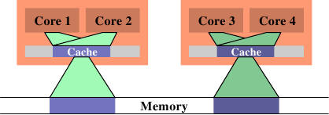

# 6.4.3. 频宽考量

当使用多条执行绪、并且它们不会因为在不同的处理器核上使用相同的cache行而造成cache争夺时，仍然会有潜在的问题。每个处理器拥有连接到与这个处理器上所有处理器核与 HT 共享的memory的最大频宽。取决于机器架构（如，图 2.1 中的那个），多核可能会共享连结到memory或北桥的相同的总线。

处理器核本身即便在完美的情况下全速运转，到memory的连线也无法在不等待的前提下满足所有载入与储存的请求。现在，将可用的频宽进一步以处理器核、HT、以及共享一条到北桥的连线的处理器的数量划分，平行突然变成一个大问题。有效率程序的效能可能会受限于可用的memory频宽。

图 3.32 显示增加处理器的 FSB 速度能帮上大忙。这就是为什么随著处理器核数量的成长，我们也会看到 FSB 速度上的提升。尽管如此，若是程序使用很大的工作集，并且被充分最佳化过，这也永远不会足够。程序开发者必须准备好识别由有限频宽所致的问题。

现代处理器的效能量测计数器能够观察到 FSB 的争夺。在 Core 2 处理器上，`NUS_BNR_DRV` 事件计算一颗处理器核因为总线尚未准备就绪而必须等待的周期数。这指出总线被重度使用，而且载入或储存至主memory要花费比平常还要更长的时间。Core 2 处理器支援更多事件，能够计算像 RFO 或一般的 FSB 使用率等特定的总线行为。在开发期间研究一个应用程序的可延展性的可能性的时候，后者可能会派上用场。若是总线使用率已接近 1.0，可延展性的机会是最小的。

若是识别出一个频宽问题，有几件能够做到的事情。它们有时候是矛盾的，所以某些实验可能是必要的。一个解法是去买更快的电脑，假如有什么可买的话。取得更多的 FSB 速度、更快的 RAM 模组、或许还有处理器本地的memory，大概 –– 而且很可能会 –– 有帮助。不过，这可能成本高昂。若是程序仅在一台机器（或少数几台机器）上需要，硬件的一次性开销可能会比重写程序的成本还低。不过一般来说，最好是对程序下手。

在最佳化程序码本身以避免cache错失之后，达到更好频宽使用率的唯一剩馀选项是将执行绪更妥善地放在可用的处理器核上。预设情况下，系统核心中的排程器会根据它自己的策略，将一条执行绪指派给一个处理器。将一条执行绪从一颗处理器核移到另一颗是被尽可能避免的。不过，排程器并不真的知道关于工作负载的任何事情。它能够从cache错失等收集资讯，但这在许多情况下并不是非常有帮助。

<figure>
  
  <figcaption>图 6.13：没效率的排程</figcaption>
</figure>

一个可能导致很大的memory总线使用率的情况，是在两条执行绪被排程在不同的处理器（或是在不同cache区域的核）上、而且它们使用相同的资料集的时候。图 6.13 显示这种状况。处理器核 1 与 3 存取相同的资料（以相同颜色的存取指示与memory区域表示）。同样地，处理器核 2 与 4 存取相同的资料。但执行绪被排程在不同的处理器上。这表示每次资料集都必须要从memory读取两次。这种状况能够被更好地处理。

<figure>
  
  <figcaption>图 6.14：有效率的排程</figcaption>
</figure>

在图 6.14 中，我们看到理想上来看应该要是怎么样。现在被使用的总cache大小减少，因为现在处理器核 1 与 2 以及 3 与 4 都在相同的资料上运作。资料集只需从memory读取一次。

这是个简单的例子，但透过扩充，它适用于许多情况。如同先前提过的，操作系统核心中的排程器对资料的使用并没有深刻的理解，所以程序开发者必须确保排程是被有效率地完成的。没有很多操作系统核心的介面可用于传达这个需求。事实上，只有一个：定义执行绪亲和性。

执行绪亲和性表示，将一条执行绪指派给一颗或多颗处理器核。排程器接著将会在决定在哪执行这条执行绪的时候，（只）在那些处理器核中选择。即使有其它闲置的处理器核，它们也不会被考虑。这听来可能像是个缺陷，但这是必须偿付的代价。假如太多执行绪排外地执行在一组处理器核上，剩馀的处理器核可能大多数都是闲置的，而除了改变亲和性之外就没什么能做的。预设情况下，执行绪能够执行在任一处理器核上。

有一些查询与改变一条执行绪的亲和性的介面：

```c
#define _GNU_SOURCE
#include <sched.h>
int sched_setaffinity(pid_t pid, size_t size,
                      const cpu_set_t *cpuset);
int sched_getaffinity(pid_t pid, size_t size,
                      cpu_set_t *cpuset);
```

这两个介面必须要被用在单执行绪的程序上。`pid` 引数指定哪个行程的亲和性应该要被改变或测定。呼叫者显然需要适当的权限来做这件事。第二与第三个参数指定处理器核的bit遮罩。第一个函数需要填入bit遮罩，使得它能够设定亲和性。第二个函数以选择的执行绪的排程资讯来填充bit遮罩。这些介面都被宣告在 `<sched.h>` 中。

`cpu_set_t` 型别也和一些操作与使用这个型别物件的巨集一同被定义在这个标头档中。

```c
#define _GNU_SOURCE
#include <sched.h>
#define CPU_SETSIZE
#define CPU_SET(cpu, cpusetp)
#define CPU_CLR(cpu, cpusetp)
#define CPU_ZERO(cpusetp)
#define CPU_ISSET(cpu, cpusetp)
#define CPU_COUNT(cpusetp)
```

`CPU_SETSIZE` 指定有多少 CPU 能够以这个资料结构表示。其它三个巨集运用 `cpu_set_t` 物件。要初始化一个物件，应该使用 `CPU_ZERO`；其它两个巨集应该用以选择或取消选择个别的处理器核。`CPU_ISSET` 测试一个指定的处理器是否为集合的一部分。`CPU_COUNT` 回传集合中被选择的处理器核数量。`cpu_set_t` 型别为 CPU 数量的上限提供一个合理的预设值。随著时间推移，肯定会证实它太小；在这个时间点，这个型别将会被调整。这表示程序必须一直将这个大小放在心上。上述的便利巨集根据 `cpu_set_t` 的定义，隐式地处理这个大小。若是需要更动态的大小管理，应该使用一组扩充的巨集：

```c
#define _GNU_SOURCE
#include <sched.h>
#define CPU_SET_S(cpu, setsize, cpusetp)
#define CPU_CLR_S(cpu, setsize, cpusetp)
#define CPU_ZERO_S(setsize, cpusetp)
#define CPU_ISSET_S(cpu, setsize, cpusetp)
#define CPU_COUNT_S(setsize, cpusetp)
```

这些介面接收一个对应于这个大小的额外参数。为了能够分配动态大小的 CPU 集，提供三个巨集：

```c
#define _GNU_SOURCE
#include <sched.h>
#define CPU_ALLOC_SIZE(count)
#define CPU_ALLOC(count)
#define CPU_FREE(cpuset)
```

`CPU_ALLOC_SIZE` 巨集的回传值为，必须为一个能够处理 CPU 计数的 `cpu_set_t` 结构而分配的byte数量。为了分配这种区块，能够使用 `CPU_ALLOC` 巨集。以这种方式分配的memory必须使用一次 `CPU_FREE` 的呼叫来释放。这些巨集可能会在背后使用 `malloc` 与 `free`，但并不是非得要维持这种方式。

最后，定义了一些对 CPU 集物件的操作：

```c
#define _GNU_SOURCE
#include <sched.h>
#define CPU_EQUAL(cpuset1, cpuset2)
#define CPU_AND(destset, cpuset1, cpuset2)
#define CPU_OR(destset, cpuset1, cpuset2)
#define CPU_XOR(destset, cpuset1, cpuset2)
#define CPU_EQUAL_S(setsize, cpuset1, cpuset2)
#define CPU_AND_S(setsize, destset, cpuset1,
                  cpuset2)
#define CPU_OR_S(setsize, destset, cpuset1,
                 cpuset2)
#define CPU_XOR_S(setsize, destset, cpuset1,
                  cpuset2)
```

这两组四个巨集的集合能够检查两个集合的相等性，以及对集合执行逻辑 AND、OR、与 XOR 操作。这些操作在使用一些 libNUMA 函数（见附录 D）的时候会派上用场。

一个行程能够使用 `sched_getcpu` 介面来确定它目前跑在哪个处理器上：

```c
#define _GNU_SOURCE
#include <sched.h>
int sched_getcpu(void);
```

结果为 CPU 在 CPU 集中的索引。由于排程的本质，这个数字并不总是 100% 正确。在回传结果的时间、与执行绪回到使用者层级的时间之间，执行绪可能已经被移到一个不同的 CPU 上。程序必须总是将这种不正确的可能性纳入考量。在任何情况下，更为重要的是被允许执行执行绪的那组 CPU。这个集合能够使用 `sched_getaffinity` 来查询。集合会被子执行绪与行程继承。执行绪不能指望集合在生命周期中是稳定的。亲和性遮罩能够从外界设置（见上面原型中的 `pid` 参数）；Linux 也支援 CPU 热插拔（hot-plugging），这意味著 CPU 能够从系统中消失 –– 因此，也能从亲和 CPU 集消失。

在多执行绪程序中，个别的执行绪并没有如 POSIX 定义的正式行程 ID，因此无法使用上面两个函数。作为替代，`<pthread.h>` 宣告四个不同的介面：

```c
#define _GNU_SOURCE
#include <pthread.h>
int pthread_setaffinity_np(pthread_t th,
                           size_t size,
                           const cpu_set_t *cpuset);
int pthread_getaffinity_np(pthread_t th,
                           size_t size,
                           cpu_set_t *cpuset);
int pthread_attr_setaffinity_np(
                           pthread_attr_t *at,
                           size_t size,
                           const cpu_set_t *cpuset);
int pthread_attr_getaffinity_np(
                           pthread_attr_t *at,
                           size_t size,
                           cpu_set_t *cpuset);
```

前两个介面基本上与我们已经看过的那两个相同，除了它们在第一个参数拿的是一个执行绪的控制柄（handle），而非一个行程 ID。这能够定址在一个行程中的个别执行绪。这也代表这些介面无法在另一个行程使用，它们完全是为了行程内部使用的。第三与第四个介面使用一个执行绪属性。这些属性是在建立一条新的执行绪的时候使用的。借由设置属性，一条执行绪能够在开始时就被排程在一个特定的 CPU 集合上。这么早选择目标处理器 –– 而非在执行绪已经启动之后 –– 能够在许多不同层面上受益，包含（而且尤其是）memory分配（见 6.5 节的 NUMA）。

说到 NUMA，亲和性介面在 NUMA 程序设计中也扮演著一个重要的角色。我们不久后就会回到这个案例。

目前为止，我们已经谈过两条执行绪的工作集重叠、使得在相同处理器核上拥有两条执行绪是合理的情况。反之亦然。假如两条执行绪在个别的资料集上运作，将它们排程在相同的处理器核上可能是个问题。两条执行绪为相同的cache斗争，因而相互减少cache的有效使用。其次，两个资料集都得被载入到相同的cache中；实际上，这增加必须载入的资料总量，因此可用的频宽被砍半。

在这种情况中的解法是，设置执行绪的亲和性，使得它们无法被排程在相同的处理器核上。这与先前的情况相反，所以在做出任何改变之前，理解试著要最佳化的情况是很重要的。

针对cache共享最佳化以最佳化频宽，实际上是将会在下一节涵盖的 NUMA 程序设计的一个面相。只要将「memory」的概念扩充至cache。一旦cache的层级数增加，这会变得越来越重要。基于这个理由，NUMA 支援函式库中提供一个多核排程的解决方法。在不写死系统细节、或是钻入 `/sys` 档案系统的深度的前提下，决定亲和性遮罩的方法请参阅附录 D 中的程序例子。

