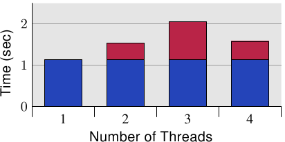

# 6.4.1. 并行最佳化

一开始，我们将会在本节讨论两个个别的议题，其实际上需要对立的最佳化。一个多执行绪应用程序在一些它的执行绪中使用共有的资料。一般的cache最佳化要求将资料保存在一起，使得应用程序的memory使用量很小，从而最大化在任意时间塞得进cache的memory总量。[^译注1]

不过，使用这个方法有个问题：若是多条执行绪写入到一个memory位置，每个相对应处理器核的 L1d 中的cache行必须处于「E」（独占）状态。这表示会送出许多的 RFO 讯息。在最糟的情况下，每次写入存取都会送出一个讯息。所以一个普通的写入将会突然变得非常昂贵。若是使用相同的memory位置，同步就是必须的（可能透过 atomic 操作[^译注3]的使用，其会在下个章节讨论到）。不过，当所有执行绪都使用不同的memory位置、并且可能是独立的时候，问题也显而易见。

<figure>
  
  <figcaption>图 6.10：并行cache行存取的间接成本</figcaption>
</figure>

图 6.10 显示这种「假共享（false sharing）」的结果。测试程序（显示于 A.3 节）建立若干执行绪，其除递增一个memory位置（5 亿次）外什么也不做。量测的时间是从程序启动、直到程序等待最后一条执行绪结束之后。执行绪被钉在独立的处理器上。机器拥有四个 P4 处理器。蓝色值表示被指派到每条执行绪的memory分配位在个别cache行上的执行时间。红色部分为执行绪的位置被移到仅一个cache行时出现的损失。

蓝色的量测（使用独立的cache行时所需的时间）与预期的相符。程序在无损失的情况下延展至多条执行绪。每个处理器都将它的cache行保存在它拥有的 L1d 中，而且没有频宽问题，因为不必读取太多程序码或资料（事实上，它们全都被cache）。量测的些微提升其实是系统的杂讯、和可能的一些预取影响（执行绪使用连续的cache行）。

使用唯一一个cache行所需的时间、以及每条执行绪一个个别的cache行所需的时间相除所计算出的量测的间接成本分别是 390%、734%、以及 1,147%。乍看之下，这些很大的数字可能很令人吃惊，但考虑到需要的cache交互影响，这应该很显而易见。已经完成写入到cache行之后，就从一个处理器的cache拉出cache行。[^译注2]在任何给定的时刻，除了拥有cache行的处理器以外，所有处理器都会被延迟，无法做任何事。每个额外的处理器都会导致更多的延迟。

<figure>
  
  <figcaption>图 6.11：四个处理器核的间接成本</figcaption>
</figure>

由于这些量测，清楚的是这种情况必须在程序中避免。考虑到巨大的损失，在许多情况下，这个问题是很显而易见的（至少，效能分析会显示程序位置），但有个使用现代硬件的陷阱。图 6.11 显示当程序执行在一台单一处理器节点具备四核的机器上（Intel Core 2 QX 6700）的等价量测。即使使用这个处理器的两个个别的 L2，测试案例也没有显示出任何可延展性的问题。当相同的cache行被使用超过一次时有些许的间接成本，但它并没有随著处理器核的数量增加。[^36]若是用多于一个这种处理器，我们自然会看到类似于那些在图 6.10 中的结果。尽管越来越多多核处理器的使用，许多机器还是会继续使用多处理器。因此，正确的处理这种状况是很重要的，这可能意味著要在真实的 SMP 机器上测试程序。

有个针对这个问题的非常简单的「修正」：将每个变数摆在它们自己的cache行。这是与先前提到的发挥作用的最佳化的冲突之处，具体来说就是应用程序的memory使用量会增加许多。这是不能忍受的；因此有必要想出一个更聪明的解法。

需要确定哪些变数一次只会被唯一一条执行绪使用到，始终只有一条执行绪使用的那些变数、也可能是那些不时会被争夺的变数。针对这些情况的每一个的不同解法是可能而且有用的。以变数的区分来说，最基本的标准是：它们是否曾被写入过、以及这有多常发生。

不曾被写入、以及那些仅会被初始化一次的变数基本上是常数（constant）。由于仅有写入操作需要 RFO 讯息，因此能够被在cache中共享常数（「S」状态）。所以，不必特别处理这些变数；将它们归在一起很好。若是程序开发者正确地以 `const` 标记这些变数，工具链将会把这些变数从普通的变数移出到 `.rodata`（唯读资料）或 `.data.rel.ro`（重定位〔relocation〕后唯读） 资料段（section）。[^37]不需其他特别的行为。若是出于某些理由，变数无法正确地以 `const` 标记，程序开发者能够借由将它们指派到一个特殊的资料段来影响它们的摆放。

当连结器构造出最后的二元档时，它首先会附加来自所有输入档、具有相同名称的资料段；那些资料段接著会以连结器脚本所决定的顺序排列。这表示，借由将所有基本上为常数、但没被这样标记的变数移到一个特殊的资料段，程序开发者便能够将那些变数全部群组在一起。它们之中不会有个经常被写入的变数。借由适当地对齐在这个资料段中的第一个变数，就可能保证不会发生假共享。假定这个小例子：

```c
int foo = 1;
int bar __attribute__((section(".data.ro"))) = 2;
int baz = 3;
int xyzzy __attribute__((section(".data.ro"))) = 4;
```

假如被编译的话，这个输入档定义四个变数。有趣的部分是，变数 `foo` 与 `baz`、以及 `bar` 与 `xyzzy` 被各自群组在一起。少了那个属性定义，编译器就会以原始码中定义的顺序将四个变数全都分配在一个叫做 `.data` 的资料段中。[^38]使用现有这段程序，变数 `bar` 与 `xyzzy` 会被放置在一个叫做 `.data.ro` 的资料段中。将这个资料段叫做 `.data.ro` 或多或少有些随意。一个 `.data.` 的前缀保证 GNU 连结器会将这个资料段与其它资料段摆在一起。

相同的技术能被用于分离出主要是读取、但偶尔也会被写入的变数。只要选择一个不同的资料段名称就可以。在某些像是 Linux 系统核心的情况中，这种分离看起来很合理。

若是一个变数永远仅会被一条执行绪用到的话，有另一个指定变数的方式。在这种情况下，使用执行绪区域变数（thread-local variable）是可能而且有用的（见 [8]）。gcc 中的 C 与 C++ 语言允许使用 `__thread` 关键字将变数定义为各条执行绪的。

```c
int foo = 1;
__thread int bar = 2;
int baz = 3;
__thread int xyzzy = 4;
```

变数 `bar` 与 `xyzzy` 并非被分配在普通的资料段中；而是每条执行绪拥有它自己的、储存这种变数的分离区域。这些变数能够拥有静态初始子（static initializer）。所有执行绪区域变数都能够被所有其它的执行绪定址，但除非一条执行绪将执行绪区域变数的指标传递给那些其它的执行绪，其它执行绪也没法找到这个变数。由于变数为执行绪区域的，假共享就不是个问题 –– 除非程序人为地造成问题。这个解法很容易设置（编译器与连结器做了所有的事），但它有它的成本。当建立执行绪时，它必须花上一些时间来设置执行绪区域变数，这需要时间与memory。此外，定址执行绪区域变数通常比使用全域或自动变数更昂贵（如何自动地将成本最小化 –– 如果可能的话 –– 的解释见 [8]）。

另一个使用执行绪区域储存区（thread-local storage，TLS）的缺点是，假如变数的使用转移给另一条执行绪，在旧执行绪的目前值是无法被新执行绪取得的。每条执行绪的变数副本都是不同的。通常这根本不是问题，但假如是的话，转移到新的执行绪就需要协调，能够在这个时刻复制目前值。

一个更大的问题是可能浪费资源。假如在任何时候都仅有一条执行绪会使用这个变数，所有执行绪都必须付出memory的代价。若是一条执行绪不使用任何 TLS 变数的话，TLS memory区域的惰性分配（lazy allocation）会防止它成为问题（除了在应用程序本身的 TLS）。若是一条执行绪仅在 DSO 中使用一个 TLS 变数，所有在这个物件中的其它 TLS 变数也都会被分配memory。假如大规模地使用 TLS，这可能会潜在地累加。

一般来说，可以给出的最好的建议是

1. 至少分离唯读（初始化之后）与读写变数。可能将这种分离扩展到，以主要是读取的变数作为第三种类别。
2. 将一起用到的读写变数一起群组在一个结构中。使用结构，是确保在某种程度上，被所有 gcc 版本一致翻译成，所有那些变数的memory区域都紧靠在一起的唯一方法。
3. 将经常被不同执行绪写入的读写变数移到它们自己的cache行。这可能代表要在末端加上填充，以填满cache行的剩馀部分。若是结合步骤 2，这经常不是真的浪费。扩展上面的例子，我们可能会产生下列程序（假定 `bar` 与 `xyzzy` 要一起使用）：

    ```c
    int foo = 1;
    int baz = 3;
    struct {
      struct al1 {
        int bar;
        int xyzzy;
      };
      char pad[CLSIZE sizeof(struct al1)];
    } rwstruct __attribute__((aligned(CLSIZE))) =
      { { .bar = 2, .xyzzy = 4 } };
    ```

    某些程序的改变是必要的（`bar` 的参考必须被取代为 `rwstruct.bar`，`xyzzy` 亦同），但就这样。编译器与连结器会做完剩下的事情。[^39]
4. 若是一个变数被多条执行绪用到，但每次使用都是独立的，则将变数移入 TLS。


[^译注1]: 因为cache的最小单位为cache行。因此若是资料摆在一起，代表它们所占用的cache行数量较少，因此一次能cache的资料量就变多。

[^译注2]: 因为所有执行绪写入的资料都在同个cache行内。因此刚写入的cache行立刻就会因为其它执行绪也要对相同的cache行进行写入，而变为「I（无效）」状态。

[^译注3]: 原子的英文 "atom" 源于希腊文 ἄτομος (拉丁转写为 atomos)，意思是「不可分割的单位」，十五世纪晚期 atomos 这词去除后缀转写为现代英语，成为 atom。电脑科学进一步借用 atomic 一词来表示「不可再拆分的」，于是 "atomic operation" 寓意为「不可再拆分的执行步骤」，也就是「最小操作」，即某个动作执行时，中间没有办法分割。倘若我们将 atomic operation 翻译为「原子操作」，可能会让人联想到高科技或者核能 (nuclear)，但事实根本不是这个意思，于是这里保留原文。

[^36]: 我无法解释在四颗处理器核全都用上时的较低的数字，但它是能够重现的。

[^37]: 资料段，由它们的名字所识别，为一个 ELF 档案中包含程序与资料的 atomic 单元。

[^38]: 这并不受 ISO C 标准保证，但 gcc 是这么做的。

[^39]: 到目前为止，这段程序都必须在命令列以 `-fms-extensions` 编译。

