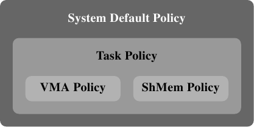

# 6.5.1. memory策略

定义一个memory策略背后的构想是，令现有的程序在不大幅度修改的情况下，能够在一个 NUMA 环境中适度良好地运作。策略由子行程继承，这使得我们能够使用 numactl 工具。这个工具的用途之一是能够用来以给定的策略来启动一支程序。

Linux 系统核心支援下列策略：

<dl>
    <dt><code>MPOL_BIND</code></dt>
    <dd>memory只会从一组给定的节点分配。假如不能做到，则分配失败。</dd>

    <dt><code>MPOL_PREFERRED</code></dt>
    <dd>memory最好是从一组给定的节点分配。若是这失败，才考虑来自其它节点的memory。</dd>

    <dt><code>MPOL_INTERLEAVE</code></dt>
    <dd>memory是平等地从指定的节点分配。节点要不是针对基于 VMA 的策略，以虚拟memory区域中的偏移量来选择、就是针对基于任务（task）的策略，透过自由执行的计数器来选择。</dd>

    <dt><code>MPOL_DEFAULT</code></dt>
    <dd>根据memory区域的预设值来选择分配方式。</dd>
</dl>

<figure>
  
  <figcaption>图 6.15：memory策略阶层结构</figcaption>
</figure>

这份清单似乎递回地定义策略。这对了一半。事实上，memory策略形成一个阶层结构（见图 6.15）。若是一个地址被一个 VMA 策略所涵盖，就会使用这个策略。一种特殊的策略被用在共享的memory区段上。假如没有针对特定地址的策略，就会使用任务的策略。若是连这也没有，便使用系统的预设策略。

系统预设是分配请求memory的那条执行绪本地的memory。预设不会提供任务与 VMA 策略。对于一个有著多条执行绪的行程，本地节点为首先执行行程的「家」节点。上面提到的系统呼叫能够用来选择不同的策略。

