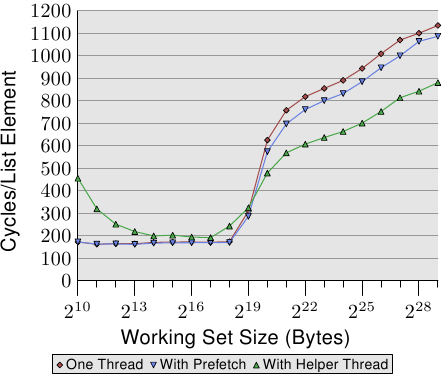

# 6.3.4. 辅助执行绪

在尝试使用软件预取时，往往会碰到程序复杂度的问题。若是程序必须迭代于一个资料结构上（在我们的情况中是个串列），必须在同个回圈中实作两个独立的迭代：执行作业的普通迭代、与往前看以使用预取的第二个迭代。这轻易地变得足够复杂到容易产生失误。

此外，决定要往前看多远是必要的。太短的话，memory将无法及时被载入。太远的话，刚载入的资料可能会被再一次逐出。另一个问题是，虽然它不会阻挡或等待memory载入，但预取指令很花时间。指令必须被解码，假如解码器太忙碌的话 –– 举例来说，由于良好撰写／产生的程序码 –– 这可能很明显。最后，回圈的程序大小会增加。这降低 L1i 的效率。若借由一次发出多个预取指令来试著避免部分成本，则会碰到显著的预取请求数的问题。

一个替代方法是完全独立地执行一般的操作与预取。这能使用两条普通的执行绪来进行。执行绪显然必须被排程，以令预取执行绪填充一个被两条执行绪存取的cache。有两个值得一提的特殊解法：

* 在相同的处理器核上使用 HT （见 3.3.4 节，Hyper-Threading）。在这种情况下，预取能够进入 L2（或者甚至是 L1d）。
* 使用比 SMT 执行绪「更愚笨的（dumber）」执行绪，其除预取与其它简单的操作之外什么也不做。这是个处理器厂商可能会探究的选项。

HT 的使用是尤其令人感兴趣的。如同我们已经在 3.3.4 节看到的，假如 HT 执行独立的程序码的话，cache的共享是个问题。反而，在一条执行绪被用作一条预取辅助执行绪（helper thread）时，这并不是个问题。与此相反，这是个令人渴望的结果，因为最低层级的cache被预载。此外，由于预取执行绪大多是空闲或者在等待memory，所以假如不必自己存取主memory的话，其余 HT 的一般操作并不会太受干扰。后者正好是预取辅助执行绪所预防的。

唯一棘手的部分是确保辅助执行绪不会往前跑得太远。它不能完全污染cache，以致最早被预取的值被再次逐出。在 Linux 上，使用 `futex` 系统呼叫 [7] 或是 –– 以稍微高一些的成本 –– 使用 POSIX 执行绪同步基本指令（primitive），是很容易做到同步的。

<figure>
  
  <figcaption>图 6.8：使用辅助执行绪的平均，NPAD=31</figcaption>
</figure>

这个方法的好处能够在图 6.8 中看到。这是与图 6.7 中相同的测试，只不过加上额外的结果。新的测试建立一条额外的辅助执行绪，往前执行大约 100 个串列项目，并读取（不只预取）每个串列元素的所有cache行。在这种情况下，我们每个串列元素有两个cache行（在一台有著 64 bytecache行大小的 32 bit机器上，`NPAD`=31）。

两条执行绪被排程在相同处理器核的两条 HT 上。测试机仅有一颗处理器核，但结果应该与多于一颗处理器核的结果大致相同。亲和性函式 –– 我们将会在 6.4.3 节介绍 –– 被用来将执行绪绑到合适的 HT 上。

要确定操作系统知道哪两个 (或更多) 处理器为 HT ，可以使用来自 libNUMA 的 `NUMA_cpu_level_mask` 介面（见附录 D）。

```c
#include <libNUMA.h>
ssize_t NUMA_cpu_level_mask(size_t destsize,
                            cpu_set_t *dest,
                            size_t srcsize,
                            const cpu_set_t*src,
                            unsigned int level);
```

这个介面能用来决定透过cache与memory连结的 CPU 阶层架构。这里感兴趣的是对应于 HT 的一阶cache。为在两条 HT 上排程两条执行绪，能够使用 libNUMA 函式（为简洁起见，省略错误处理）：

```c
cpu_set_t self;
NUMA_cpu_self_current_mask(sizeof(self),
                           &self);
cpu_set_t hts;
NUMA_cpu_level_mask(sizeof(hts), &hts,
                    sizeof(self), &self, 1);
CPU_XOR(&hts, &hts, &self);
```

在执行这段程序之后，我们有两个 CPU bit集。`self` 能用来设定目前执行绪的亲和性，而 `hts` 中的遮罩能被用来设定辅助执行绪的亲和性。这在理想上应该在执行绪被建立前发生。在 6.4.3 节，我们会介绍设定亲和性的介面。若是没有可用的 HT ，`NUMA_cpu_level_mask` 函式会回传 1。这能够用以作为避免这个最佳化的征兆。

这个基准测试的结果可能出乎意料（也可能不会）。若是工作集塞得进 L2，辅助执行绪的间接成本将效能降低 10% 到 60% 之间（主要在比较低的那端，再次忽略最小的工作集大小，杂讯太多）。这应该在预料之中，因为若是所有资料都已经在 L2 cache中，预取辅助执行绪仅仅使用系统资源，却没有对执行有所贡献。

不过，一旦不再足够的 L2 大小耗尽，情况就改变。预取辅助执行绪协助将执行时间降低大约 25%。我们仍旧看到一条上升的曲线，只不过是因为无法足够快速地处理预取。不过，主执行绪执行的算术操作与辅助执行绪的memory载入操作彼此互补。资源冲突是最小的，其导致这种相辅相成的结果。

这个测试的结果应该能够被转移到更多其它的情境。由于cache污染而经常无用的 HT ，在这些情境中表现出众，并且应该被善用。附录 D 介绍的 NUMA 函式库令执行绪兄弟的找寻非常容易（见这个附录中的范例）。若是函式库不可用，`sys` 档案系统令一支程序能够找出执行绪的兄弟（见表 5.3 的 `thread_siblings` 栏位）。一旦能够取得这个资讯，程序就必须定义执行绪的亲和性，然后以两种模式执行回圈：普通的操作与预取。被预取的memory总量应该视共享的cache大小而定。在这个例子中，L2 大小是有关的，程序能够使用

`sysconf(_SC_LEVEL2_CACHE_SIZE)`

来查询大小。辅助执行绪的进度是否必须被限制取决于程序。一般来说，最好确定有一些同步，因为排程细节可能会导致显著的效能降低。

